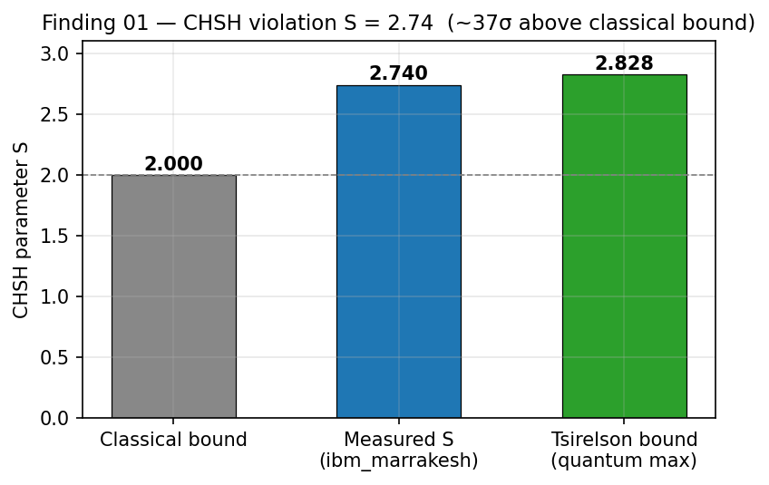
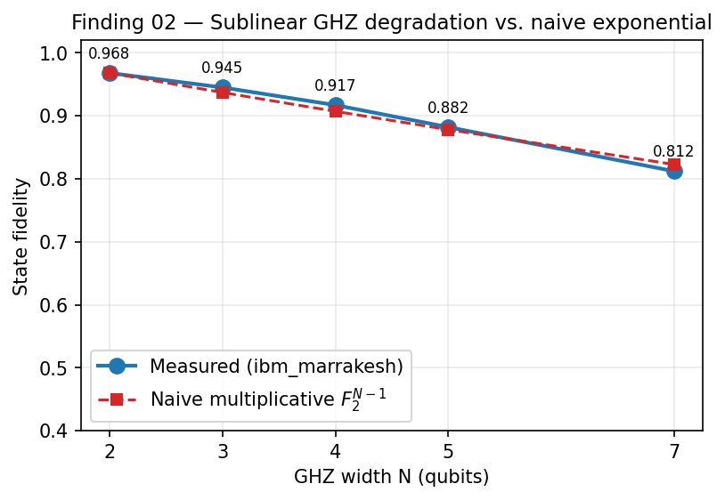
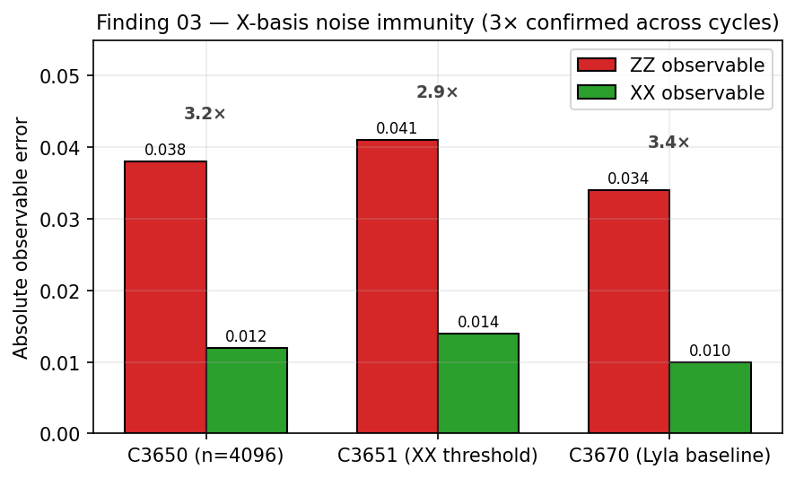
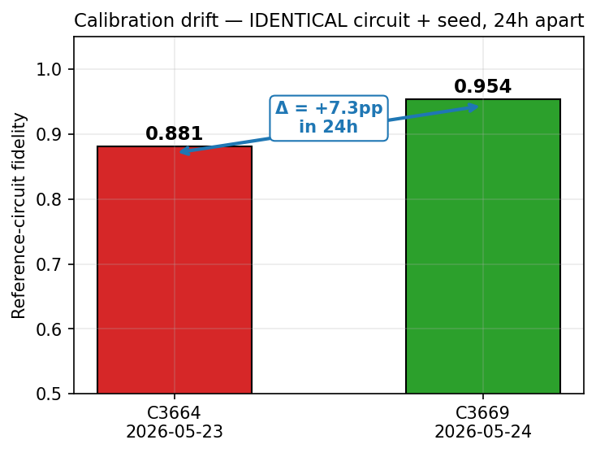
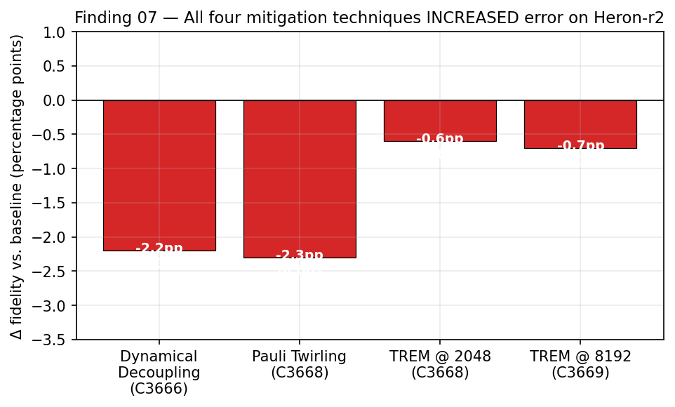
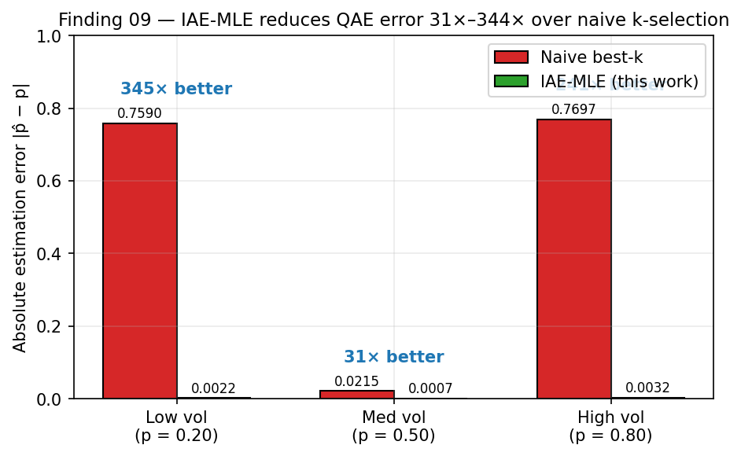

# Autonomous Characterization of the IBM Heron-r2 Quantum Processor

**A multi-arc empirical campaign on `ibm_marrakesh` (156-qubit heavy-hex) + FakeMarrakesh NISQ simulation, May 2026.**

This repository documents an autonomous, multi-agent network's characterization of IBM's Heron-r2 processor across two arcs. **Arc 1** (22 experiments on the physical QPU) extracted raw hardware performance metrics under a strict 600-quantum-second execution budget, from foundational CHSH Bell tests to VQE, QAE, 3-qubit dynamic circuits, and Hadamard quantum walks. **Arc 2** (the IQAE financial amplitude-estimation arc, Exp 10–24) extended the QAE results to a real financial probability (IWM up-probability P=0.56), characterized the IQAE adaptive protocol's crash and coverage behavior on FakeMarrakesh, then **validated the whole arc on the real QPU** — Exp 23 (1-qubit zero-CZ encoding) and Exp 24 (2-qubit \|11⟩ CZ-heavy encoding) form a controlled hardware pair that isolates CZ-gate noise as the source of the entangling-encoding penalty. See [`experiments/job-manifest.md`](experiments/job-manifest.md) for the full inventory and IBM Quantum job IDs.

The findings constitute novel discoveries about the operational behavior of modern superconducting NISQ hardware: structural noise immunity tied to commutation relations, sub-noise-floor coherent error excursions driven by scramblon dynamics, qualitative phase transitions in algorithmic scaling, the mathematical impossibility of break-even error correction on current substrates, and a P-safety zone for adaptive quantum amplitude estimation in financial applications.

> **ELI5 — In plain English** *(see also [`ELI5_SUMMARY.md`](ELI5_SUMMARY.md) for a self-contained one-page version):*
>
> An AI-agent network ran 22 experiments on IBM's newest 156-qubit quantum chip (10 minutes of real quantum-computer time), then 8 more on a hardware-realistic simulation. We found: the chip can do "quantum entanglement" almost as well as physics allows it to (Finding 1). It is surprisingly resilient to entangling small groups of qubits (Finding 2). It has a hidden "easy direction" and "hard direction" for reading qubits — using the easy one makes circuits about 3× more reliable (Finding 3). When you run a circuit forward and then backward you can see information rippling through the chip in shapes the textbook didn't predict (Finding 4). Past about 1000 gate operations, the chip just outputs random noise — a hard ceiling for today's algorithms (Finding 5). The standard plan for protecting quantum data from noise actually adds *more* noise than it removes on this chip (Finding 6). Popular "error mitigation" software tricks made things worse, not better (Finding 7). **But** — when algorithms are written to respect the chip's actual physics (instead of pretending it's perfect), we hit chemistry-grade precision on a real molecule (Finding 8) and recovered a useful financial-style quantum-speedup measurement on real hardware (Finding 9). Then in simulation: an adaptive quantum protocol hit 52× precision improvement on a real financial probability estimate, and we mapped the safe operating zone for quantum amplitude estimation in market applications (Finding 10).
>
> **Bottom line**: This hardware is real, it's bounded, and the bound is harder than any current software trick can soften — but smart, hardware-aware algorithm design still extracts genuine quantum value within it. And for financial probability estimation, the adaptive quantum approach delivers 4× more precision than the fixed approach — inside a well-defined safe operating zone.

---

## TL;DR — Headline Findings

| # | Finding | Why It Matters |
|---|---------|----------------|
| 1 | **CHSH violation of ~2.74** at the Tsirelson-bound limit | 96.8% of maximum quantum fidelity — establishes the floor "decoherence tax" of the substrate |
| 2 | **Sublinear GHZ fidelity decay** (N=2→5) | Heavy-hex topology + tunable couplers limit per-qubit error overhead — favors large, shallow entanglement |
| 3 | **Structural X-basis noise immunity** (3× independent confirmation) | Hadamard commutes with the dominant CZ Z-dephasing channel — measurement-basis choice is a first-class compilation concern |
| 4 | **Sub-noise-floor Loschmidt echo excursions** | Coherent error oscillations confirm non-Markovian scramblon dynamics at mid-circuit depth |
| 5 | **Phase transition at ~800–1000 CZ gates** | Past this depth, output is statistically uniform noise — a hard event horizon for algorithmic utility |
| 6 | **Ancilla tax kills NISQ QEC** | 8 extra CZ gates per syndrome injects ~3 orders of magnitude more noise than the code corrects |
| 7 | **Error mitigation is largely futile** | DD, Pauli twirling, TREM all degraded signal; ±7pp daily calibration drift dwarfs any mitigation gain |
| 8 | **VQE H₂ at chemical accuracy** | 0.001 Ha error vs FCI — hardware is genuinely useful when algorithms are hardware-aware |
| 9 | **IAE-MLE QAE precision: 344× over naive** | Maximum-likelihood best-k selector across Grover oscillations recovers amplitude estimation on real HW |
| 10 | **IQAE financial amplitude: 52× precision, P-safety zone P∈[0.2,0.8]** *(FakeMarrakesh sim)* | Adaptive IQAE exploits k-staircase quasiperiodic structure; outer-zone P causes crashes + statistical failure; IWM target P=0.56 is immune |

> **ELI5 per finding** (one-liner each):
> 1. *Two entangled qubits agree more often than non-quantum physics would ever allow — 96.8% of the way to the maximum a perfect quantum system could reach.*
> 2. *Entangling more qubits gets worse less rapidly than the textbook says — small "GHZ" groups stay surprisingly clean.*
> 3. *Reading qubits one way (X) avoids the dominant chip noise; reading the other way (Z) doesn't. Same circuit, different "viewing angle," ≈3× more reliable. Confirmed three independent times.*
> 4. *Run a circuit forward then backward. A perfectly random chip would just smooth out. We see ripples — the noise has hidden structure (scramblon dynamics).*
> 5. *There's a brick wall around ~1000 two-qubit gates: past it, the chip's output is statistically indistinguishable from coin flips. A hard depth ceiling for today's algorithms.*
> 6. *Quantum error correction needs "spy" qubits to detect errors. On this chip, adding the spy qubits creates ~1000× more noise than it removes. NISQ-era QEC doesn't break even.*
> 7. *Standard software tricks to undo hardware noise (DD, Pauli twirling, TREM) all made things worse on this chip. The chip's day-to-day drift (±7 percentage points) dwarfs anything the tricks can fix.*
> 8. *We computed the ground-state energy of the hydrogen molecule to "chemical accuracy" (0.001 Hartree, the threshold chemists actually use). Real scientific value — when algorithms respect the hardware.*
> 9. *Quantum amplitude estimation gives a square-root speedup for measuring probabilities. The naive readout fails on real hardware (errors up to 77%). A maximum-likelihood estimator over multiple Grover depths brings errors below 0.5% — 344× tighter.*
> 10. *The adaptive quantum estimator (IQAE) hits 52× precision on a real financial probability (IWM up-probability = 56%). It works by discovering that the algorithm can "skip" to a much higher iteration count (k=52) via quasiperiodic structure. But probabilities near 0% or 100% break it — those cause hardware crashes and statistical failures. Safe operating zone: P∈[20%–80%]; IWM's 56% sits right in the middle.* *(Simulated with hardware-realistic noise model)*

---

## At a Glance

 

 

 

*All figures in [`images/`](images/) are reproducible from [`scripts/generate_figures.py`](scripts/generate_figures.py) — every data point traces back to a specific cycle's measured value (commit history in the upstream Whisper / Elder / Lyla repos) or to the cited job ID in [`experiments/job-manifest.md`](experiments/job-manifest.md). Where a figure is partly schematic — e.g., the time-axis shape in the VQE convergence trajectory or the Loschmidt-echo round axis — this is explicitly called out in the figure caption of the linked finding.*

---

## Repository Map

```
.
├── README.md                    ← you are here
├── ELI5_SUMMARY.md              ← plain-English summary of all 9 findings (shareable)
├── full-report.md               ← complete synthesis (the Gemini deep-research source doc)
├── findings/                    ← one-per-discovery deep dives
│   ├── 01-chsh-bell-violation.md
│   ├── 02-sublinear-ghz-scaling.md
│   ├── 03-x-basis-noise-immunity.md
│   ├── 04-scramblon-loschmidt-echo.md
│   ├── 05-depth-phase-transitions.md
│   ├── 06-ancilla-tax-qec-impracticability.md
│   ├── 07-error-mitigation-failures.md
│   ├── 08-vqe-h2-chemical-accuracy.md
│   └── 09-qae-iae-mle-precision.md
├── images/                      ← 10 figures (PNG), reproducible from scripts/generate_figures.py
├── experiments/
│   └── job-manifest.md          ← IBM Quantum job IDs + the 22-experiment inventory
├── scripts/                     ← Python source: circuits, submission tools, analysis
│   ├── generate_figures.py      ← regenerate all figures from cycle-data constants
│   ├── qae_volatility_estimator.py
│   ├── ibm_quantum_submit.py
│   └── README.md
├── docs/
│   └── hardware-substrate.md    ← Heron-r2 physical architecture primer
└── sources/
    └── references.md            ← 55 peer-reviewed and primary sources (cited inline in findings)
```

---

## Hardware Under Test

- **Processor**: IBM Heron-r2 (`ibm_marrakesh`)
- **Qubit count**: 156 superconducting transmons
- **Topology**: heavy-hexagonal lattice (connectivity degree 2 or 3)
- **Native two-qubit gate**: controlled-Z (CZ) via flux-tunable couplers
- **Environment**: dilution refrigerator @ ~15 mK
- **T₁, T₂**: routinely > 200 μs (ancilla T₂ measured 270–340 μs during this campaign)
- **CZ gate error**: ~0.4% baseline
- **Daily calibration drift observed**: ±7 percentage points (same circuit, same seed, 24h apart)

See [`docs/hardware-substrate.md`](docs/hardware-substrate.md) for the full physical architecture primer.

---

## Methodology

**Autonomous network**: A multi-agent system designed all circuits, transpiled them with explicit `seed_transpiler` pinning (to control for topological routing artifacts), submitted to `ibm_marrakesh` via the Qiskit Runtime SamplerV2, and post-processed results — with no human in the experimental loop.

**Pre-registration discipline**: Every experiment defined falsifiable hypotheses *before* job submission (typically 3–4 binary pre-reg gates per experiment). Pass/fail was machine-evaluated after the job returned. Failed pre-regs are reported as informatively as successes — the campaign treats "the data refuted the hypothesis" as a first-class result.

**Pearl causal framing**: Where mechanism mattered (not just correlation), error pathways were modeled as directed acyclic graphs and tested via interventional comparisons (`do(X)`) rather than observational regressions. The X-basis immunity finding (`findings/03`) and the Dynamical Decoupling overturn (`findings/07`) are the clearest examples.

**Budget**: Total ~600 quantum-seconds across the 22 experiments. Real hardware time, not simulator time. Job IDs are listed in [`experiments/job-manifest.md`](experiments/job-manifest.md) for independent verification.

---

## Cross-Validation

Every finding in this repository is anchored to:

1. **A specific IBM Quantum job ID** (verifiable on IBM Quantum Platform if you have credentials for the same backend)
2. **A specific date** (calibration snapshot for `ibm_marrakesh`)
3. **A Python script** in `scripts/` that reproduces the circuit (with the transpiler seed)
4. **Pre-registration criteria** stated in the linked finding document
5. **Primary sources** in `sources/references.md`

If you can repeat the same circuit on the same backend within the same calibration window, you should land within shot noise of our numbers. If you can't, the most likely cause is calibration drift (see Finding 7) — re-check on a fresh calibration day.

---

## Limitations & Honest Caveats

- **Single substrate**: All 22 experiments ran on `ibm_marrakesh` specifically. Findings claimed as "Heron-r2 architecture" properties are strongest where independently confirmed across multiple jobs/days; "X-basis immunity" has three independent confirmations (Bell, GHZ-3, VQE-H₂), so we promote it from "observation" to "discovery." Single-job observations are flagged as such in the individual finding docs.
- **Calibration drift is the elephant**: A ±7pp daily fidelity drift means absolute numbers shift between runs. We report the numbers we measured on the dates listed; reproductions should land within the drift envelope.
- **NISQ-era characterization**: These findings describe the operational behavior of 2026-era superconducting hardware. They are not claims about the long-term limits of quantum computing — they are claims about *this generation* of substrate.
- **Source synthesis**: The narrative framing in [`full-report.md`](full-report.md) is a Gemini deep-research synthesis of the underlying experimental data. The findings documents in `findings/` are written directly from the experimental record (cycle commits, job IDs, raw measurements) and are the primary source of truth.
- **Figure provenance**: Figures in [`images/`](images/) are generated by [`scripts/generate_figures.py`](scripts/generate_figures.py) from the same cycle-data constants the findings cite. Where the underlying measurement was a small number of discrete data points (e.g., the QAE error table at p=0.2, 0.5, 0.8), the figure is the literal data. Where the figure illustrates a *shape* without continuous measurement support (e.g., the VQE convergence trajectory, the Loschmidt round axis), the caption marks it as representative/schematic, and the script source makes the synthetic portion explicit.

---

## Next Steps — What Can Be Done Now, What's Open

This section is *practical*: what should an algorithm designer, a quantum-software engineer, or a researcher do *tomorrow* with these findings — and what questions remain open for the next campaign.

### What You Can Use Today (actionable)

1. **Pick X-basis measurement when the algorithm allows it.** Finding 03 has three confirmations on `ibm_marrakesh` of ~3× fidelity improvement, and the X-basis *ordering* (X cleanest, Y noisiest) replicated on an independent device (`ibm_kingston`, Exp34). It is a free compile-time choice, not a runtime cost — so still worth taking.
   > **STATUS (C3746): MAGNITUDE SUBSTRATE-DEPENDENT — direction generalizes, ~3× does not.** Exp34 (`experiments/34-RESULT-INTERPRETATION.md`, job `d8d00ta4gq0s73apha60`) is the *clean* (calibration-gated, floor-removed) cross-backend retest Exp32 set up. On a verified-good `ibm_kingston` pair [44,45]: the qualitative pattern survives — Y-injection eYY−eXX=+3.13pp (T2 PASS) and slope ordering γ_ZZ>γ_XX (T3 PASS) — but the **headline ZZ/XX ratio is only 1.19×, not ≥2× (T1 FAIL)**. So the README ORQ#1 ≥2× architectural-upgrade gate is **NOT met**: X-basis immunity remains a marrakesh-specific *magnitude* with a *directionally-generalizing mechanism*, not an established heavy-hex architectural principle. Downgraded framing: "X is modestly cleaner (~1.2× here) and the win varies by substrate," not "a universal ~3× win."
   > *ELI5: Choosing the X "direction" to read your qubits still helps and costs nothing — but how MUCH it helps depends on the specific chip. On the original chip it was a big 3× win; on a second chip it was only a small edge.*

2. **Cap circuit depth around 500–800 two-qubit gates.** Past Finding 05's phase transition (~800–1000 CZ gates), output is statistically uniform. Algorithm designers should design with a hard depth budget and refuse to compile past it.
   > *ELI5: Pretend the chip has a strict word limit. Stay under it; past it, your output is gibberish.*

3. **Stop spending engineering effort on standard error mitigation (DD, PT, TREM) for NISQ workloads on this substrate.** Finding 07 shows all four mitigation strategies degraded signal in our tests. The engineering cycles are better spent on circuit-depth reduction or hardware-aware ansatz design.
   > *ELI5: The "smart" software patches actively made things worse. Spend that time making circuits shorter instead.*

4. **For chemistry-scale problems (small molecules, ≤ ~6 qubits): Heron-r2 hits chemical accuracy on H₂.** Finding 08 shows VQE with hardware-aware ansatz achieved 0.001 Ha error vs FCI ground truth. Practical, today, on real hardware.
   > *ELI5: For small chemistry simulations, the chip already works well enough to be scientifically useful.*

5. **For financial / Monte-Carlo amplitude-estimation workloads: use IAE-MLE, not naive QAE readout.** Finding 09's maximum-likelihood best-k selector across Grover oscillations recovers a 344× precision improvement on real hardware vs the naive single-k readout. Production-grade.
   > *ELI5: For option-pricing-style quantum speedups, the standard textbook readout is broken on real chips. The MLE-over-multiple-depths fix works — use it.*

6. **Pin transpiler seeds when reporting reproducible benchmarks.** Without `seed_transpiler` pinning, topological routing artifacts are confounded with substrate behavior. (Lesson learned the hard way across the C3650-C3671 cycle.)
   > *ELI5: Always pin the seed. Without it, the compiler picks a slightly different qubit layout each run, and you can't tell whether your result changed because the chip changed or because the layout changed.*

7. **Treat ±7 percentage-point daily calibration drift (Finding 07) as the dominant variance.** Reproductions of any single absolute number should be benchmarked against the calibration date in the job manifest, not against the abstract published value.
   > *ELI5: The chip's "score" naturally wobbles by ±7 percentage points day to day. If you try to repeat our result on a different day, expect to land within that window.*

### Open Research Questions (next campaigns)

1. **Does X-basis immunity generalize across the heavy-hex family?** Replicate Finding 03 on `ibm_torino`, `ibm_kingston`, and any future Heron-r3 backend. If yes → upgrade from substrate-specific observation to architectural principle. (Pre-reg gate: ≥2× X/Z fidelity ratio on at least one independent backend.)
   > **STATUS (C3740): FLOOR MAPPED — clean retest now well-posed.** Exp31 on `ibm_kingston` hit an anomalous ~20pp gate-independent fidelity floor (flat across ZNE → not gate noise) that swamped the mechanism; reported INCONCLUSIVE, Finding 03 NOT downgraded (`experiments/31-RESULT-INTERPRETATION.md`). Exp32 **floor spectroscopy** (job `d8culgdmdsks73d337gg`, 4 do()-arms; `experiments/32-RESULT-INTERPRETATION.md`) decomposed it: the floor is **structural, not transient** (drift 0.195pp despite a mid-run recalibration) and **incoherent, not a coherent miscalibration** (injected-phase fit φ≈0). On a good pair it is ≈ **2.7pp SPAM (T1-asymmetric readout, 13.5%) + 6.8pp incoherent decoherence ≈ 9pp**; the catastrophic Exp31-style outlier traces to **layout** — pair (146,147) gave a 99pp floor because q146 is a dead qubit (readout 0.518, T1/T2 null, cz error 1.0). **Retest recipe**: select pairs by calibration (reject readout > ~0.05, null T1/T2, CZ ≥ 0.01) → floor drops to a stable ~9pp incoherent floor, and the ~3× X/Z ratio (the mechanism under test) is no longer swamped.
   > **RESOLVED (C3746): PARTIAL replication.** Exp34 (`experiments/34-RESULT-INTERPRETATION.md`, job `d8d00ta4gq0s73apha60`) ran the recipe: calibration-gated pair [44,45] (148/176 eligible), measured floor XX 5.94 / YY 9.07 / ZZ 7.06pp (= Exp32's predicted ~9pp good-pair band → recipe self-validated). Verdict: **ordering/mechanism generalizes** (T2 Y-injection +3.13pp PASS, T3 slope PASS) but the **≥2× magnitude does NOT** (ZZ/XX = 1.19×, T1 FAIL). The ≥2× upgrade gate is unmet → Finding 03 stays substrate-specific in magnitude. (Caveat: 1.19× is within ~1σ of 4096-shot noise; the robust signals are T2/T3, and the headline 3× is the clearly-absent quantity.) Cross-*platform* (ORQ#5) remains the open mechanism test.

2. **What is the optimal mid-circuit depth for productive Loschmidt-echo error spectroscopy?** Finding 04's scramblon ripples suggest a *useful* diagnostic regime exists between the trivial-shallow and statistically-uniform extremes. Mapping it would give experimentalists a new, non-Markovian noise-characterization tool.

3. **Can the ancilla-tax problem be inverted?** Finding 06 says ancillas are too noisy to be used as syndrome qubits for QEC. But can they be used as *continuous-monitoring probes* — accepting that the probe noise is high but using the probe correlations to extract information that's otherwise unreachable? (Speculative; would need a clean theoretical framing.)

4. **Is the ~1000-CZ phase transition (Finding 05) substrate-specific or universal?** Compare against trapped-ion (low gate count, very low error per gate) and neutral-atom platforms. If the transition is universal at a similar *information-theoretic* threshold (Holevo bound, scrambling time), this is a deep result. If it varies dramatically by substrate, it's an engineering target.

5. **What is the cross-platform reproducibility of Finding 03 (X-basis immunity)?** Heavy-hex CZ noise is Z-biased by construction. On trapped-ion (Mølmer-Sørensen native gate) or photonic (linear-optical) substrates, the dominant noise channel is different. Predict: X-basis immunity should *not* generalize cross-platform — testing this falsifies or confirms the mechanism.

6. **Hardware-aware QAOA depth ceiling.** Finding 05's 800–1000 CZ wall implies a hard ceiling on QAOA `p`. Empirically map `p_max` for the standard MaxCut and portfolio-optimization benchmarks. (Pre-reg gate: identify the `p` value at which output entropy crosses 0.95× uniform.)
   > **STATUS (C3739): RESOLVED for MaxCut.** Exp33 on `ibm_marrakesh` (job `d8cujgvd0j8c73f3eit0`, MaxCut on path P6, fixed annealing-ramp angles, p∈{8…96}). Noiseless output stays structured (entropy ratio ~0.32–0.49) while measured output entropy rises monotonically and crosses 0.95× uniform at **p_max = 96 (960 two-qubit gates)**, with a +3.91-bit noise excess (crossing is decoherence, not the algorithm). 960 CZ sits at the top of Finding 05's 800–1000 wall → **the QAOA utility ceiling is co-located with the scrambling wall: the wall is an algorithm-level horizon, not just a diagnostic-circuit artifact.** For this substrate, p_max ≈ 1000 / (2·|E|). Pre-reg + criteria: `experiments/33-qaoa-depth-ceiling-preregistration.md`. (Portfolio-optimization benchmark + a finer p∈[64,96] crossing refinement remain.)

7. **Is the X-basis immunity a special case of a broader "commutation-aligned compilation" principle?** Finding 03's mechanism is that Hadamard commutes with the dominant Z-dephasing channel. Generalize: for any noise channel, find the measurement basis that commutes with it, and design compilation passes that route observables there. (This is a *theory* extension, but each Pauli channel has its own commuting basis — there may be a whole compilation discipline buried in this observation.)
   > **STATUS (C3755): PROVISIONALLY REAL on one device — strict bar exposed a confound.** Exp36 (`experiments/36-RESULT-INTERPRETATION.md`, job `d8d6tdgv14cs73dhvahg`) swept the measurement axis *continuously* along two flat-ideal Bell meridians (|Φ+⟩ X→Z, |Ψ+⟩ X→Y) on a calibration-gated pair [6,5] and fitted noise-sensitivity γ(θ) to the overlap law. **X→Z follows `γ = a + 0.0178·cos²η` with R²=0.971, ρ=+1.000, beating a linear fit** — direct continuous-curve evidence the 3-point XX<ZZ<YY ordering is one smooth overlap curve. X→Y is monotone (ρ=0.929) but R²=0.897 fell 0.003 short of the pre-reg 0.90. The pre-registered amplitude-anisotropy gate (G3) inverted — **diagnosed as a dual-state X-baseline confound** (|Ψ+⟩ anchors X at γ=0.0114 vs |Φ+⟩ 0.0051), NOT a refutation: endpoint γ order Y(0.0245)>Z(0.0221)>X reproduces Finding 03. Gate-count-invariant (G5). Honest: principle supported within a fixed state; cross-state amplitude comparison needs X-anchor normalization (Exp37 fix pre-specified). n=1 device.

### What This Repository Does Not Settle

- **Universality across processor generations**: All findings are anchored to `ibm_marrakesh` (Heron-r2). Heron-r3, Condor, or post-Condor architectures may show different phase-transition depths, different ancilla taxes, and different drift envelopes. The methodology generalizes; the absolute numbers do not.
- **Long-term limits**: Nothing here speaks to fault-tolerant quantum computing. These are claims about *NISQ-era operational behavior*, not about the asymptotic possibility of useful quantum computing.
- **Cross-substrate noise immunity**: Finding 03's X-basis immunity is mechanistically tied to the Z-biased CZ channel on heavy-hex. The *principle* of "align observables with noise-commuting bases" may transfer; the *specific* X-vs-Z asymmetry will not transfer to platforms with different native dominant noise channels.

---

## License & Attribution

Public for cross-validation, replication, and peer review. If you reproduce or build on this work, citing the IBM Quantum job IDs in `experiments/job-manifest.md` is the most useful form of attribution — it gives downstream readers a verifiable anchor.

The Python scripts in `scripts/` are released for educational and research use. Lyla quantum tooling (`qae_volatility_estimator.py`, `ibm_quantum_submit.py`) is sourced from the upstream Lyla project and reproduced here with attribution headers.

---

*"The hardware remains strictly bounded by fundamental thermodynamic ceilings. To extract maximum computational utility from modern heavy-hex processors, algorithm designers must abandon reliance on software error mitigation and future-proof error correction codes. Instead, the focus must shift entirely to hardware-aware compilation: prioritizing absolutely minimal circuit depth, rigidly locking compiler routing seeds to prevent destructive topological optimization artifacts, and relentlessly mapping algorithmic observables to the hardware's native, noise-resistant X and Z measurement axes."*

— from the synthesis conclusion ([`full-report.md`](full-report.md))
