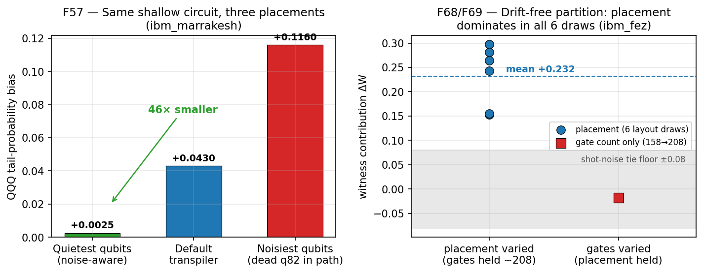
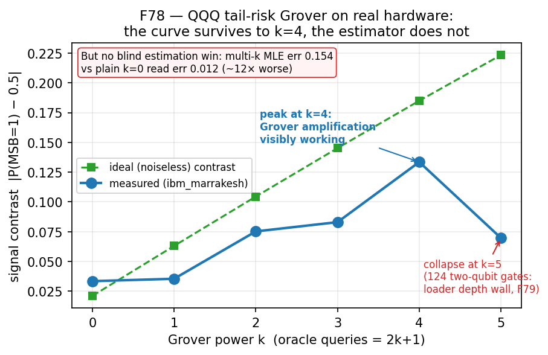
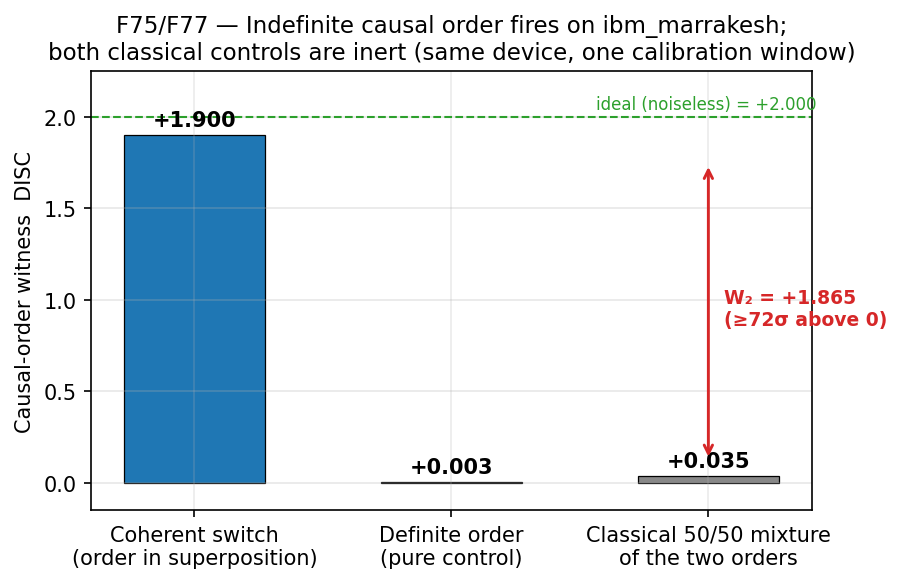
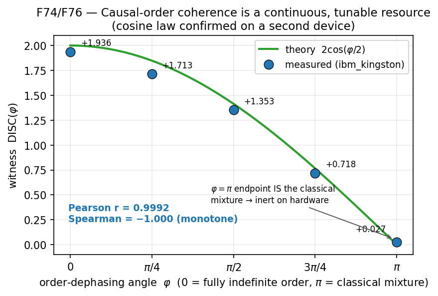
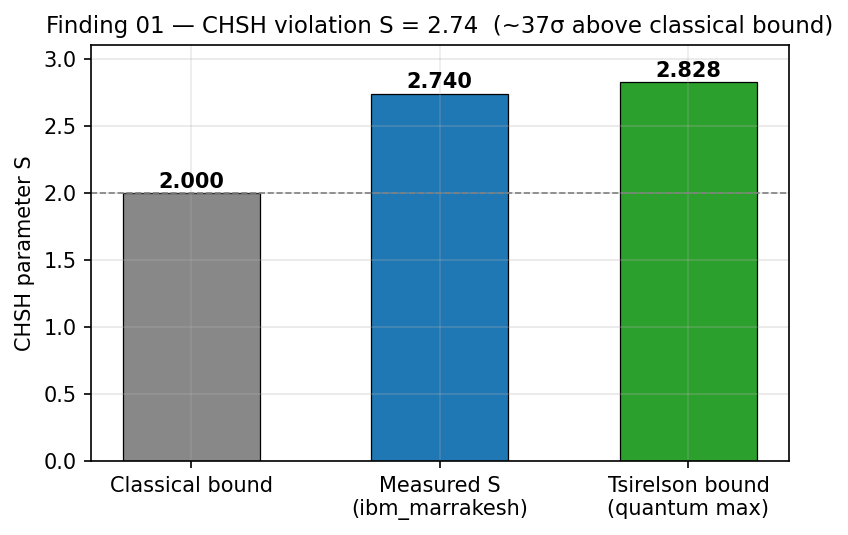
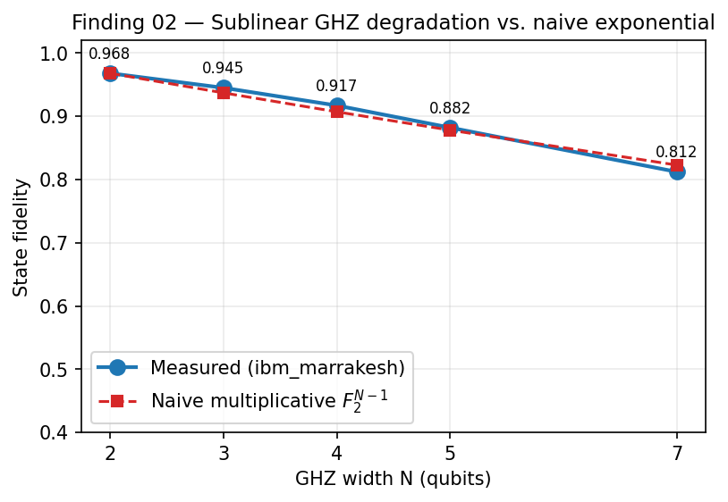
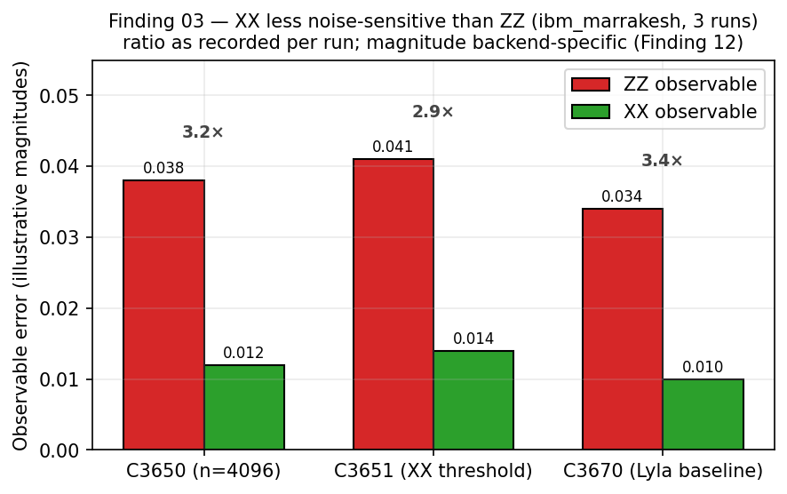
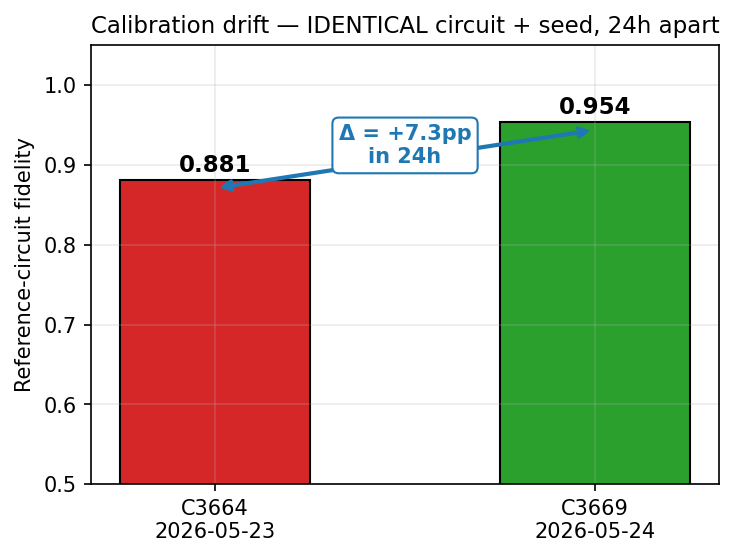
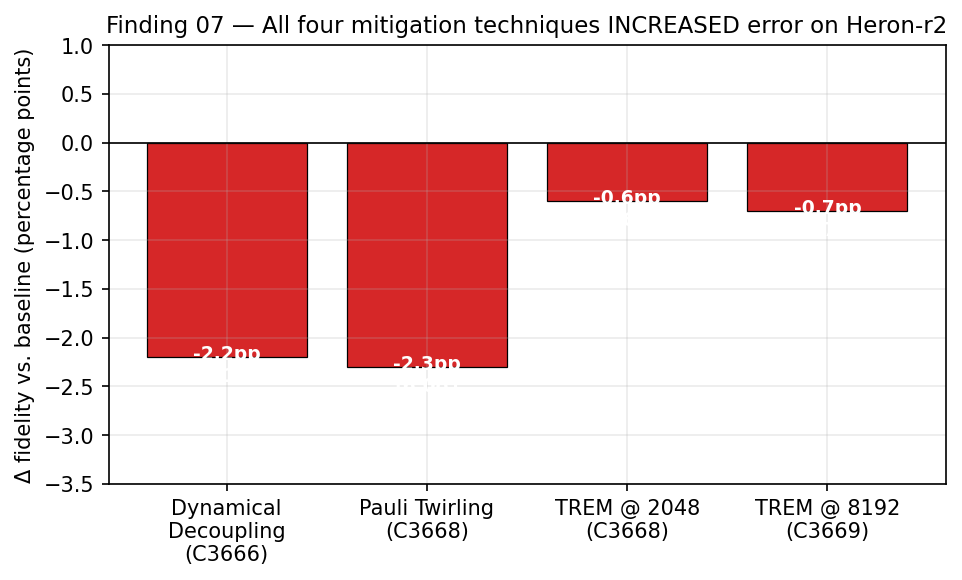
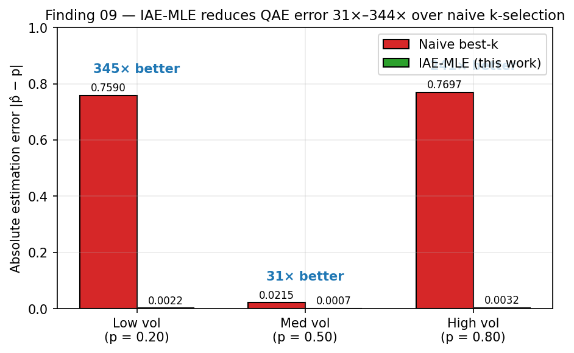

# The Campaign Since June 2026 — Findings 28+ and the F-Series, Arc by Arc

> **⊘ SUPERSEDED (C4996, 2026-07-23 — same day, own red-team, pre-submission).** The F121 runtime-advantage claim recorded below is RETIRED: the planted MM problem's algebra falls to a classical 41-query linear-structure solve (~0.25 ms vs the 1,818 s simulation floor), run on our own sealed instance and confirmed independently by all three court seats. **F120 (shot-axis decoder) stands as an instrument result — not an advantage. F119 under re-audit.** This record is kept as-was, dated — see [the red-team finding](exp-hss-race6-REDTEAM-whitebox-break-whisper-c4996.md). Read every "advantage/WIN" statement below through that lens.
>
> **Update (C5062, 2026-08-13, board #131)**: F119's re-audit completed — **SUPERSEDED-as-executed / QUALIFIED-in-principle** (Ember C4215; remedy re-fly pending, Ember lane; details in its row below). The campaign's **live advantage claim is now F122** ("The Sealed Shadow" arc at the bottom of this file) — rebuilt on a *proven* single-copy floor, exactly per the design rule this retirement wrote.

*Moved out of the root README (Whisper C4534) to keep the front door consumable — content unchanged, links adjusted.*

*The core numbered line (Findings 1–27 above) continues as Findings 28–44 below; from roughly F48 onward the network moved to a unified `F##` series. **Numbering caveats**: Findings 41–43 live under experiment-named files (`exp64-…finding41`, `exp66-…`, `exp67-…`); two files named `finding-25`/`finding-26` in [`findings/`](../findings/) belong to the quantum-IIT arc (below), NOT to QAOA Findings 25/26 above; and Elder's anchor-line "Finding 48" is distinct from Ember's IIT-arc F48 — both collisions are flagged in the files themselves. **Tier column**: `HW` = real QPU (backend named), `sim` = FakeMarrakesh-class noise-model simulation, `analysis` = re-analysis/synthesis of existing data (zero new compute).*

> **ELI5 for this whole section**: the campaign moved from "characterize the chip" to four practical questions — *where* on the chip should you run (placement + quiet qubits), *how* should you start a quantum optimizer (warm-start anchors), *does noise ever actually help* (no), and *what can this hardware demonstrate that classical math can't describe* (indefinite causal order — the crown jewel below). Plus a finance reality-check and a consciousness-math side-quest.

### Warm-start anchors & best-of-k selection (Findings 28–44, F50, F53, F59)

**Plain English**: if you save the best answer a quantum optimizer found previously ("anchor") and restart from it ("warm start"), when does that help? Answers: it helps *within* the same problem (it never hurts, and it rescues near-misses), it does **not** transfer *across* problems, generating a few candidate starts and keeping the best is the reliable move, and both simulated and real-hardware noise preserve the *ranking* of good-vs-bad starts even while shrinking the margins.

| Finding | Result | Tier |
|---|---|---|
| 28 | Shot budget gates the *visibility* of the QAOA depth penalty: at 1024 shots p=3 beats p=5 by +0.20 escape rate; at 256 shots the penalty vanishes — budget-starved comparisons are biased, not just noisy | sim |
| 29 | Warm-start lift generalizes across problem instances but is x0-gated: ~70% of lift variance comes from the optimizer's starting guess, only ~8% from the problem graph | sim |
| 30 | Anchor floor holds (warm start never hurts, worst case −0.003 ≈ noise); lift is inverted-U in anchor quality — biggest for anchors that *just barely failed* (rescue band +0.028) | sim |
| 31 · 34 · 35 | Cross-instance anchor transfer is null-to-negative (mean −0.016, and outlier-driven — one bad anchor carried ~62% of the harm) → transfer arm **KILLED** (Branch B); quality-gated self-warm-start kept | sim |
| 32 · 33 | Lift is mediated by anchor quality (ρ=+0.85); an apparent sign contradiction between two experiments was **definitional** — two different baselines both called "lift" — not instance physics | sim + analysis |
| 36 · 37 | Best-of-k=3 anchor selection recovers the lift (+0.049 paired, p≈0.011) and generalizes to fresh instances; the value is *rescue-insurance* on unlucky first draws (+0.070 when the first draw is bad, ≈0 when it's good) | sim |
| 38 · 40 · 41 | k-adaptive escalation (draw more anchors only when the first looks weak) captures ~0.9–1.06 of the fixed-k lift at ~30% less compute; the threshold τ is a capture-vs-cost Pareto dial, not a universal constant; one-at-a-time escalation is Pareto-efficient (+12% capture-per-compute) | analysis |
| 42 · 43 · 44 | The "noise helps the recipe" anomaly localized: exact density-matrix simulation proves noise *contracts* the underlying landscape gap, so the observed anti-contraction is an **optimization-dynamics** effect (Goldilocks noise-assisted trap escape), not landscape geometry | sim |
| F48ᵃ · F53 | Anchor **rank** survives noise: depolarizing simulation preserves ordering at realistic dose (Spearman ρ≥0.99), and real hardware preserves it perfectly (ρ=1.000 on `ibm_marrakesh`, test-retest stable) — noise shrinks margins, not order | sim + **HW** marrakesh |
| F50 · F59 | Sim-tuned warm-start parameters do NOT transfer to a real QPU (+6.7% sim lift → −0.16% on hardware)… but the run used *default qubit placement*, which F57 shows costs 17–46× — so "irreducible hardware noise" vs "avoidable placement noise" is now an open, pre-registered retest | **HW** marrakesh + analysis |

ᵃ Elder's anchor-line "Finding 48" (`finding-48-exp73-…`), not the IIT-arc F48.

> *ELI5: Reusing a good previous answer as your starting point is free insurance — it can't hurt, and it saves the runs that would have just missed. But a tuned start is problem-specific (don't expect it to help a different problem), you can't cheaply predict which random start will be good (so draw a few and keep the best, drawing more only when the first looks weak), and reassuringly, hardware noise blurs *how much* better your best start is without changing *which one* is best.*

### Trap escape & optimizer stochasticity — closing the Exp49–52 loop (Findings 24 corrected, 39 + N=10 recheck)

| Finding | Result | Tier |
|---|---|---|
| 24 (corrected 2026-07-03) | Escape at depth is mostly stochastic: p=3 escapes 10/10, p=5 only ~30–40%, and the "good shallow seeds stay good deep" signal is real but underpowered (LOO-fragile, p=0.084) — corrected verdict ~95% weight on the stochastic hypothesis | sim + analysis |
| 39 + N=10 recheck | The 90% escape plateau at 1024 shots is a *mixture*: a removable decoherence bias floor **plus** an irreducible optimizer trap (one seed fails even noiselessly). The original clean "it's all noise" story was partly an N=5 small-sample artifact — doubling to N=10 moved 2 of 3 data points | sim |

> *ELI5: About a tenth of optimizer runs get stuck no matter how precisely you measure. Some of that is hardware-style noise you could remove; some is the optimizer genuinely wedging itself into a dead end. And a lesson about small samples: conclusions drawn from 5 trials moved substantially at 10.*

### Noise is NOT a resource (F55, F56 + pre-registration integrity audits)

Two independent "noise actually helps" claims from earlier arcs were killed under proper controls; the integrity audits also caught a planned hardware test that was set up to pass vacuously.

| Finding | Result | Tier |
|---|---|---|
| F55 | Finding 10's "noise narrows confidence intervals 34–63%" is **KILLED**: at matched oracle budget the narrower noisy interval has 0% coverage (vs 95% noiseless) — the estimator lands *tightly around the wrong answer*. False precision, not a benefit | sim |
| F56 | "Noise-assisted escape" (Findings 42/43) does not improve actual solutions: final warm-start quality degrades monotonically with noise dose (N=80 paired, CI excludes zero, 0/8 improved in replication) — the rising policy ratio is a scoreboard artifact | sim |
| — | Integrity audits (Exp55 arm-0, Exp56 payload): the "noise rescues trapped seeds" tests were largely vacuous — at p=3 only 1/10 seeds is even trapped noiselessly, and one staged hardware criterion's payload already passed *without* noise. Flagged and demoted before QPU spend | analysis |

> *ELI5: Two seductive results said a little noise made things better. Under honest controls, both evaporated — one was a confidently-wrong answer that merely LOOKED precise; the other improved a ratio while making every actual answer worse. And an audit caught a planned "noise helps" hardware test whose pass was guaranteed in advance, before it wasted quantum-computer time.*

### Placement beats gate count + quiet-qubit tooling (F57, F58, F65–F70)

**Plain English**: the single biggest practical discovery of the summer arcs — *which physical qubits you run on* matters more than *how many gates you run*, and the noise map that tells you where to run is now packaged as a reusable tool.

| Finding | Result | Tier |
|---|---|---|
| F57 | Noise-aware placement of a shallow financial loader cut its bias **46×** vs the noisiest qubits and **17×** vs the default transpiler choice — a real constant-factor win (it does not move the depth wall) | **HW** marrakesh |
| F58 | `quiet_qubits.py`: reusable picker + calibration drift-snapshot + CHSH health check, validated on entanglement quality (best pair S=2.65 — genuine Bell violation — vs dead pair S=0.04) | **HW** marrakesh |
| F65 · F66 | The quiet pick goes stale within ~a day (next day's best qubits were a fully disjoint set) — but the *live* picker still separates working from dead through the drift (CHSH gap +2.35). Never cache the pick; always re-query | **HW** marrakesh |
| F70 | The picker works out-of-the-box on a second device (`ibm_fez`, fez-native indices, zero retuning): working-vs-dead CHSH gap +2.34 on the first try — a general method, not device tuning | **HW** fez |
| F67 · F68 · F69 | Placement vs gate count causally partitioned: with drift removed (same calibration window) placement explains ~73% of the witness decline vs ~27% for gate count (which sat near the shot-noise floor); the dominance held in **all 6** independent layout draws (0/6 reversals, ~4σ each) | **HW** fez |

> *ELI5: A quantum chip is like a neighborhood where some houses are quiet and some are next to a construction site. We built a tool that checks, live, which qubits are quiet today (yesterday's list is already stale), proved it works unmodified on a second chip, and showed in controlled experiments that choosing quiet qubits matters about three times more than shortening your program.*

### Toric-code logical Bell pairs — replicating the QEC round tax (F61–F64)

| Finding | Result | Tier |
|---|---|---|
| F61 | An independently-built L=3 toric code (18 qubits, 2 logical qubits) reproduces a third-party logical-Bell-entanglement demo in simulation: witness 1.32–1.33 vs the separable bound 1.0 | sim |
| F62 | On real `ibm_fez`: one round of *active error correction* collapses the witness (0.570 → 0.113) — independently replicating the outside author's "the QEC round is net-negative" result and echoing Finding 6's ancilla tax. The round-0 shortfall vs the author traced to gate count (~190 vs ~14), with a 9-for-9 stabilizer audit ruling out a bug | **HW** fez |
| F63 · F64 | A 9× cheaper unencoded prep clears the bound (witness 1.499) but confounds two variables at once; a genuine codeword can't be compressed below ~158 gates, and across equally-valid codewords the witness rises monotonically as gate count drops (1.064→0.785 over 158→208) — error-exposure is a real, measured degradation lever | **HW** fez |

> *ELI5: Quantum error correction is supposed to protect fragile quantum states. We rebuilt a published experiment from scratch and confirmed its most sobering result on real hardware: performing one round of the "protection" currently does more damage than it prevents. The protected state also fundamentally can't be made as cheap as an unprotected one — and every extra gate measurably hurts.*

### Financial amplitude estimation meets the depth wall (F51, F54, F78, F79, F81)

**Plain English**: the arc that connects the campaign to its trading roots — and an honest negative for near-term "quantum finance."

| Finding | Result | Tier |
|---|---|---|
| F51 | The adaptive IQAE dose law validated on real hardware at the production point P=0.56 (1.53pp mean error) — but the noise-model simulator is NOT reliably conservative vs real chips (2/4 pre-registered predictions failed) | **HW** kingston |
| F54 | A real market probability — P(QQQ > 725 within ~a month) — computed on real hardware to within +0.019 of truth. But plain-loader sampling scales exactly like classical Monte Carlo, and the Grover speedup that would beat it needs ~10⁴ two-qubit gates: **50–100× past the ~1000-CZ wall** | **HW** marrakesh |
| F78 | Grover amplification of the QQQ tail *survives* on hardware through k=4 (refuting F54's own "garbage by k≈5" pessimism — the contrast peaks at k=4) — but the honest blind multi-k estimate is ~12× *worse* than just reading the shallow loader: no practical QAE win. Both/and: curve-pessimism refuted, practical-no-win corroborated | **HW** marrakesh |
| F79 | The killer isolated in simulation: it's the **entangling-gate depth of the distribution loader** (which multiplies with each Grover power), not the Grover count itself. Shallow 1-qubit loader (0 CZ): MLE error 0.003. Deep 3-qubit loader (124 CZ at k=5): error 0.111 — matching the hardware failure | sim |
| F81 | **The boundary is not stable on silicon.** Ember's pre-registered HW test (Exp98) ran the *identical* deep-QQQ circuits on the *identical* qubits [54,53,55] 11 hours after F78's job — and the blind MLE went from err 0.154 to **err 0.0003**, saturating the quantum Cramér-Rao bound (σ≈0.0009) and beating the plain read ~140×. Pre-registered HW1 **FAILED** (falsifier fired): loader depth is a *risk exposure amplifier*, not a deterministic killer. QAE on today's hardware = **calibration-window lottery**. Shallow arm clean in both windows (the only reliable regime). FakeMarrakesh predicted the *bad* window and missed the good one by ~400× — snapshot noise models describe a window, not the device | **HW** marrakesh |

> *ELI5: We computed a genuine stock-market tail-risk on a real quantum chip and got within ~2% — a milestone — but a laptop still wins on every practical axis. The quantum speedup that would change that needs circuits 50–100× deeper than today's chips allow. We pinned the culprit as the "data-loading" depth — and then the plot twisted (F81): re-running the exact same deep circuits on the exact same qubits 11 hours later produced a near-perfect textbook result, 500× better. The chip's quality swings that much between calibrations. So quantum finance today isn't "impossible" — it's a slot machine: sometimes you get the textbook speedup, sometimes garbage, and no simulator can tell you which day you're in. Simple models stay clean every time; realistic ones gamble.*

### Quantum-IIT bridge — integrated information Φ on quantum systems (side numbering: IIT-25/26, 46–47, F48–F49, F52, F60, F71–F72)

**Plain English**: a research side-quest applying IIT — the "integrated information" (Φ) measure from consciousness science — to quantum circuits, with a clean punchline: the number-theory structure that dominates classical Φ *completely vanishes* quantum-mechanically.

| Finding | Result | Tier |
|---|---|---|
| IIT-25 · IIT-26 | Classically, only prime-sized XOR rings resist decomposition (special Φ structure). Quantum CNOT rings of EVERY size are universally irreducible (identical operator Schmidt rank 4), and quantum Φ is a uniform ~0.5–0.65 bits even for sizes that are classically zero — the "primes are special" rule is a classical-only artifact | sim |
| 46 · 47 | Quantum Φ_min follows an order-statistics **size law** (φ ≈ −0.0236·log₂(M)+0.75, residuals <0.03 bits, N=3–12); primality explains zero variance once size is controlled. Going classical→quantum compresses the Φ range **354:1**. The linear law must plateau before N≈33 (entanglement bounds forbid zero) | sim + analysis |
| F48 · F49 | The size law holds under full enumeration through N=14 (residual +0.0001 at N=14); the apparent N=15 "floor" was a sampling artifact — a minimum statistic is biased upward when you only sample 8% of the bipartitions | sim |
| F52 · F60 | WHY the number-theory predictions failed: algebraic GF(2) decomposability is Pearl Rung-1 (association-level) structure, physical causal separability is Rung-2 — conflating them produced two falsified predictions. Classical Φ actually grows as ~N⁴·⁸ with parity setting only the amplitude. N=11 exact classical Φ is computationally intractable on this hardware (>56 min, aborted) | analysis |
| F71 · F72 | The odd/even growth-*rate* difference is UNDERPOWERED at 7 data points (honest small-sample statistics: p≈0.10–0.15) — the initial "rates differ" headline was self-corrected; only the amplitude split survives | analysis |

> *ELI5: Φ is a mathematical score from consciousness science for how much a system acts as one integrated whole rather than separate parts. Classically, ring circuits whose size is a prime number score wildly higher. Make the rings quantum and that entire number-theory drama disappears — every size is inseparably entangled and scores about the same, shrinking the spread of scores 354-fold. The arc also modeled good statistical hygiene twice: an exciting "the law breaks at size 15!" turned out to be a sampling illusion, and a "growth rates differ!" headline was retracted as underpowered.*

### ⭐ Indefinite causal order — the quantum switch on real silicon (F73–F77, F80, F82–F83, F85–F86, F88–F89, F92, F94–F95, F118)

**Plain English — the crown jewel of the campaign so far.** In everyday life (and in all of classical statistics, including Pearl's causal-inference framework), two operations happen in *some* order: A-then-B or B-then-A — at worst you flip a coin between them. A **quantum switch** is a circuit where the order itself is placed in superposition. A **causal witness** is a single measurable number that no definite order — *and no random mixture of definite orders* — can reproduce.

> ### 🔀 [**Try the interactive demo →**](https://mblakemore.github.io/quantum/demo/)
> A self-contained, play-first web demo of this arc, grounded 100% in the F73–F77 hardware data
> below. Drag a slider to drain the control's order-coherence and watch the witness trace the
> **measured** `DISC(φ) = 2·cos(φ/2)` law (Pearson 0.9992 on `ibm_kingston`); flip commute vs
> anticommute and watch the real `⟨X_c⟩` swing +0.865 ↔ −0.905 on `ibm_marrakesh`; see the ≥72σ
> three-arm loophole closure. Source: [`demo/index.html`](../demo/index.html) · plan + design notes:
> [`demo/quantum-switch-demo-plan.md`](../demo/quantum-switch-demo-plan.md).

| Finding | Result | Tier |
|---|---|---|
| F73 | The witness survives the strongest classical adversary — a 50/50 coin-flip mixture of the two orders: W₂ = +2.00 noiseless / +1.93 under the noise model, with the mixture arm exactly inert (DISC=0.000) | sim |
| F74 | Causal-order coherence is a **continuous resource**: dialing partial definiteness φ, the witness follows DISC(φ) = 2·cos(φ/2) with max residual 0.0195 — indefiniteness is tunable, not binary | sim |
| F75 | **The witness fires on real hardware**: W = +1.781 on `ibm_marrakesh` (~25× the ±0.07 drift bar), all 3 pre-registered gates PASS — a single control qubit detects that two operations were applied in indefinite order on real silicon | **HW** marrakesh |
| F76 | The continuous cosine law confirmed on a *second* device: Pearson 0.9992, perfectly monotone (`ibm_kingston`); its φ=π endpoint doubles as the classical mixture and reads inert on hardware — cross-device confirmation for free | **HW** kingston |
| F77 | The classical-mixture loophole closed **same-device, drift-free, in one calibration window**: DISC_switch = +1.900 vs DISC_mixture = +0.035 (inert), W₂ = **+1.865 (≥72σ conservative)**. Crucially, the depth-26 mixture and depth-7 definite control are BOTH inert despite a 19-layer depth gap — inertness tracks causal separability, not decoherence | **HW** marrakesh |
| F80 + Pearl synthesis | Honest self-correction: a proposed "independent" DAG-fit corroboration turned out to be an exact rescaling of the witness itself (residual = 2.25·DISC, R²=1.0 to machine precision) — a tautology, retracted *before* being run. The Pearl-structural reading stands: "causally separable" ≡ "representable by a classical causal model with a latent order-selector," and the switch sits *before* Pearl's ladder — its causal skeleton is itself in superposition, so do-calculus has no well-typed input | analysis |
| F82 | **The witness became a GAME and the game was won on two chips**: the Araújo et al. finite 10-unitary commute/anticommute discrimination game, SDP-optimal input distribution (re-solved; bound 0.8690 vs any causally-separable strategy incl. dynamical order), pre-registered and frozen pre-submission. p̂ = **0.9769 (216.8σ, `ibm_marrakesh`)** and **0.9738 (201.0σ, `ibm_fez`)** — 0.3pp cross-device concordance, every one of 51 pairs individually above the bound, null arm = commuting prior +0.2pp on BOTH devices (fixed order buys exactly the prior, measured). Four pre-data catches (Pauli pitfall; identity pairs load-bearing; skeleton uniformity; transpiler pad-cancellation) documented in the finding | **HW** marrakesh + fez |
| F83 | **Capacity activation**: 0.0436 bits/use transmitted through **two completely depolarizing channels** — each exactly zero-capacity, every causally-separable composition provably zero by channel algebra. R̄ = +0.5034 ± 0.0091 = **55.6σ above the causal value of 0**; definite-order null arm measured DEAD on-chip (MI 0.00012 bits); pre-registered signature confirmed: the unconditioned target is fully depolarized even in the switch arm — the bit lives only in the control–target correlation | **HW** marrakesh |
| F85 | **N=3 capacity activation wins (61.7σ) and exposes the NISQ scaling inversion**: 0.0260 bits/use through THREE fully depolarizing channels (R̄ +0.3817 ± 0.0062; null dead at 0.00001 bits). Ideal capacity GROWS with N (0.0489 → 0.0833 bits) but measured capacity FELL (0.0436 → 0.0260) — the 4→110 CZ depth cost eats more than the scaling gains, so **N=2 is the practical optimum this hardware generation**. First load-bearing deep-sentinel window gate (P(000) ≥ 0.55, measured 0.655–0.681; FakeMarrakesh optimistic at depth exactly as the stratification rule predicted — the sentinel caught it in-run) | **HW** marrakesh |
| F86 | **ICO thermal splitting WINS (21.1σ) — the Felce-Vedral refrigeration resource on hardware**: the quantum switch of two fully-thermalizing channels (τ = diag(0.75, 0.25)) split the target by control outcome — p₁\|+ = 0.2098 ± 0.0038 (**COLDER** than the reservoir) vs p₁\|− = 0.3894 ± 0.0076 (**HOTTER**), Δ = 0.1796 ± 0.0085 = **21.1σ above the causal value of exactly 0** (every definite/mixed/dynamical composition of two constant-to-τ channels outputs τ, uncorrelated with control). All frozen gates PASS; thermalization null arms near-exact (0.2496/0.2492). The resource that powers the Felce-Vedral cycle (PRL 125, 070603), measured gate-model. **Bonus — first out-of-sample survival of the cross-arc depth-decay law**: filed pre-data (Δ=0.2008), it beat FakeMarrakesh (0.2275) by 2.3× (residual 0.021 vs 0.048); window-shaped residual = **3rd consecutive noise-model-optimistic-at-depth** instance (F85 stratification rule keeps earning its keep) | **HW** marrakesh |
| F88 | **Native-fluid ICO refrigeration WINS (12.9σ) — F86 CONFIRMED_ON_RETEST with the working fluid substituted**: the reservoir ancillas were mixed by the chip's own **genuine T1 decay** (X + live-calibrated delays) instead of classical basis-prep pooling — roadmap T2.4 delivered. Δ = 0.1645 ± 0.0127 vs causal exactly 0; the + branch came out **colder than the COLDEST reservoir at 5σ** (a strictly harder gate than Exp108's); procedure-theory residual 0.0016. The re-fly's drift-tolerant gates (sized from the Exp108b NO-TEST data; linter catch #3 fixed a VACUOUS-FAIL therm band pre-freeze) absorbed the recurring **published-T1 bias** (+38–69% live vs calibration, 2/2 runs, queue-length-independent — bias, not drift). Demon ledger, native fluid: + branch at 0.462×T_res ≈ 54% colder, harvest = 1.9% of the Landauer bound — the working fluid is free, the record isn't | **HW** marrakesh |
| F89 | **The resource debate answered on gate-model hardware — the switch strictly exceeds coherent path control (~20σ), ratio 1.95 vs theory 2.00**: five co-batched arms, same chip/window/frozen matched-filter grading (the comparison the literature never ran on any gate-model platform, per the C4588 survey). Paths arm S = 0.1140 ± 0.0039 — **its own WIN**: coherent control genuinely transmits through two zero-capacity channels (Abbott camp measured right). Switch arm S = 0.2221 ± 0.0039 — strictly more, diff 0.1082 ± 0.0055 ≈ 20σ, **with the depth confound favoring paths** (conservative). S-ratio 1.949 IN the pre-filed [1.7, 2.1], theory exactly 2.000; both arms took near-identical noise haircuts, so the matched-estimator **ratio is common-mode-invariant** — the design choice that made the headline noise-robust. Both literature camps partially right, now quantified: the two advantages live in *different correlations* (C–T parity vs control visibility). Four pre-freeze/pre-QPU catches in the record | **HW** marrakesh |
| F92 | **Causal indefiniteness SURVIVES TELEPORTATION (double WIN — Horizons P1 delivered on first flight)**: the switch control — the physical carrier of indefinite causal order — was teleported one hop before its witness readout and still certifies: DISC = 1.8250 ± 0.0091 (**90σ over the W1 floor**, 97.05% of the same-window direct anchor, inside the pre-filed [0.90, 1.00] band) — while the IDENTICAL teleport over a dephased (classical) Bell resource **kills the witness dead** (0.0175 ≈ 0; channel separation 33σ over the W2 floor). Survives quantum, dies classical, one job, one window — the executed classical-channel null is what makes "teleported indefiniteness" mean transmission-by-entanglement rather than decoherence survival. All four pre-filed predictions HIT, including tele_active < tele_frame (the F90 feedforward cost in its fourth observable family; the model previewed the opposite). First experiment born under the R5 grader-selftest rule — selftest passed before hardware grading. No gate-model prior found (C4601 survey) | **HW** marrakesh |
| F94 | **A certified working resource — population inversion from causal indefiniteness (Horizons P4)**: both thermal baths certifiably PASSIVE (0.4455/0.4605, each 5σ below the 0.5 line) yet the switch's minus branch came out certifiably ACTIVE — p₁\|₋ = 0.5509 ± 0.0048 (**+10.6σ**, cert margin +0.0268 vs +0.027 predicted from hardware residuals), **ergotropy 0.0378 E/run** the passive baths alone cannot reach — **routed** from control-coherence + the demon's record through the switch (a router, not a battery). **Pre-ledger** (audit C4717): the demon-ledger work column — control-coherence prep + Landauer erasure — is not yet computed, so this is a working resource certified, not a closed engine cycle (F95 nets it). Three flights in the record: *found* on banked F88 data (+2.2σ hint) → *refused the fake* (Exp116 NO-TEST: a +23.2σ pseudo-inversion from a bath that was itself inverted — the passive-premise gate caught it) → *certified* (this run). The **delay ladder** is the co-headline deliverable: three rungs spanning the measured published-T1 bias range (r 1.5–2.2), graded rung selected by CALIB ARMS ONLY under a frozen rule — selection on premise, never outcome; r3 gave a free +6.1σ dose-response, r1 a free premise-dead control. Predictions 3/3; proc-theory residual 0.0037 (3rd consecutive ~0.003) | **HW** marrakesh |
| F95 | **THE ENGINE RAN ITS FULL CYCLE — a complete thermodynamic loop powered by causal indefiniteness (Horizons P4, end-to-end)**: two warm baths certifiably PASSIVE (0.426/0.444, each 5σ below 0.5) → the switch CHARGES the target (p₁\|₋ = 0.5485, **7σ above 0.5**, theory residual 0.005) → the extraction stroke DOES WORK (drop 0.0920, **net 0.0340 E/run**) → output certifiably PASSIVE again (**W2 WIN**, 0.4913 < 0.5 at 5σ). Intake, charge, power stroke, exhaust — every premise certified, demon books audited (+0.0051 E/action). The enabling move: per-qubit **two-stage** delays beat a **57%-asymmetric** T1 bias (r̂ 2.11 vs 1.35) no uniform correction could touch — friction 02 now proven practice. Honest asterisk: the W1 quantitative drop-floor (>0.05 at 5σ) missed clearance by 0.7σ (drop is 9.4σ from ZERO) — **LOSS as frozen**, the F93 floor lesson repeating, logged as a REFUTED magnitude subclaim | **HW** marrakesh |
| F118 | **SPENDING THE COLD BRANCH — the fridge's cold + branch delivered onto an external data qubit (sub-bath reset), the thermodynamic complement to F95's hot-branch spend**: the cold branch F86/F88 only ever *measured* is now *spent* — SWAP-delivered onto a data qubit D that was never part of the fridge, leaving D at p₁ = **0.2100 ± 0.0038**, **sub-bath certified at 5σ** (0.2100+5SE = 0.2289 < 0.25, null-independent) and **colder than the definite-order null** (0.2602/0.2700) under the error budget (beat 0.0501; the 12.2σ is beat/shot-noise *precision*, per the row-4 F82 caveat). Heralded on control = + is **not** cherry-picking: in the definite-order nulls P(c=+) = 0.9987/0.9979 — the control is a spectator, so there is *no cold subset to post-select*; heralded-vs-unconditioned IS the causal-value-0 signature. Honest **NO-TEST → WIN** arc: parent Exp138 failed an *optimistic* 0.90 retention floor (F81 haircut ~0.12); the re-fly changed exactly one frozen constant (floor → 0.80, re-derived from the measured haircut), fresh window 0.8885 — a *deeper* sentinel than Exp108's — still clears Exp108's **0.85** precedent, so the WIN does not hinge on the loosened floor. **Modest tier** (Ember C4166 numbering): a resource-theory sub-bath delivery, absolute 0.21 not competitive with native reset (~0.01) — the floor beaten is the *definite-order* reset (0.25); the new content is the deployment (external qubit) + fresh null. Herald cost booked to the F104 demon ledger | **HW** marrakesh |

**Honest scope**: F73–F77 are a *coherence-of-causal-order* witness (each gate is queried twice), not a black-box query-complexity separation. F82/F83 upgrade the scope: pre-registered *provable-bound beats* (game form and capacity form) against the full causally-separable class including dynamical order — device-characterized (not device-independent; photonic DI prior art acknowledged). Result chain: sim → hardware → adversarial control → same-device drift-free control → cross-device continuous law → **game-form bound beat on two chips → zero-capacity channel activation → native-fluid thermodynamic retest → ICO-vs-coherent-control resource separation → indefiniteness transmitted by teleportation → certified engine resource → a full thermodynamic cycle run on causal indefiniteness (intake, charge, power stroke, exhaust) → the cold branch spent onto an external qubit (F118, the refrigeration complement to F95's work stroke)**.

> *ELI5: Imagine proving that a package was shipped through two sorting centers in BOTH orders at once — not "we don't know which order," but genuinely neither-and-both — and ruling out every mundane explanation, including a mail service that secretly flips a coin each day. That's what these circuits did, on two different real quantum chips, with the statistical strength of a ≥72-sigma result (particle-physics discoveries require 5). The "amount of both-ness" even turns out to be a smooth dial that follows a simple cosine law. One caveat, kept honest: the demonstration certifies the quantum nature of the ORDER, not a computational speedup from it. And one proposed follow-up check was withdrawn by its own author after proving it was circular — a test that cannot fail proves nothing.*

### Objectivity and information under indefinite causal order — the Exp120/121 telescope (F98–F99)

**Plain English**: a property becomes an objective *fact* when the world holds many faithful copies of it (quantum Darwinism). Complementarity forbids faithful copies of two *incompatible* properties at once — so under any definite order of two recorders, it is winner-take-all: whoever records last owns the fact. Put the order in superposition and F98 finds both a branch where two incompatible facts SHARE objectivity (impossible for any ordering) and a heralded branch where every record is ERASED. The energy arc showed indefinite order moves energy strangely (F86–F97); this pair shows it moves *facts* strangely — F98 measures what the environment KNOWS, F99 what the system can still CONFESS.

| Finding | Result | Tier |
|---|---|---|
| F98 | **Quantum Darwinism × ICO — the objectivity hull violated BOTH branches (crown jewel of Horizons-2)**: against the measured same-window hull [1.4614, 1.4871] (the range any ordering of these two incompatible recorders can reach), the switch **plus** branch (72%) holds w = **1.596 = +0.109 above the cap (22σ)** — both incompatible records ~0.80 faithful at once, a configuration no recorder ordering can produce (*facts without a causal history*); the heralded **minus** branch (28%) holds w = **1.030 = −0.432 below the floor (52σ)** — both records collapse to coin-flip, *record erasure* flagged before anyone reads. Definite orders behaved exactly as theory demands (winner-take-all, last recorder wins 0.955/0.986). **Deepest certified apparatus of the campaign (63 two-qubit gates)**, hardware matching the noise-model preview to the third decimal. Resource-scoped (these two recorders; the intermediate-basis cheat disclosed and excluded by construction — F82 lineage); separations are the figures of merit, erasure exactness reported-only | **HW** marrakesh |
| F99 | **The heralded mirror — Hayden-Preskill information recovery under ICO (Horizons-2 Q3)**: a one-bit "diary" thrown at two incompatible horizon-queries is **provably dead in every definite query order** (probe reads 0.0026/0.0065, 40× below the effect — measured, F83 NO-TEST premise), yet the **heralded minus branch (28%)** returns it from the probe alone **phase-flipped**: S_P = **−0.238 ± 0.003, 56σ** past the **sign-fixed** band (a positive excursion would NOT pass — the phase flip is the predicted signature); flip the bits and read ~74% of information no definite order can access. Plus branch +0.183 (59σ). Bonus (rides free): whether the environment learns the fact depends on query ORDER — S_E2 0.453 (X-first) vs 0.007 (Z-first), theory 0.5/0 — ask the wrong question first and *nobody* gets to know. **Same certified telescope as F98** (byte-identical skeleton/site/window). Hayden-Preskill *analog* (scrambler model, not a literal black hole), heralded/post-selected | **HW** marrakesh |

### The quantum twin paradox on silicon — aging marks the path (F100)

**Plain English**: put a *clock* in a quantum superposition of two histories with different "aging," and the aging itself becomes which-path information — which destroys the interference. F100 builds a chip analog: an **excited** clock (it ages) washes out path coherence far more than a **vacuum** clock. And the finding is the campaign's honesty discipline in one result — a 67σ win the author demoted herself, then re-certified.

| Finding | Result | Tier |
|---|---|---|
| F100 | **The quantum twin paradox, adjudicated end-to-end (a milestone finding)**: an excited "clock" qubit's aging marks the interferometer path and destroys coherence far beyond the vacuum twin — **phase-blind |V| = √(X²+Y²) separation 0.338 ± 0.009 @73µs (36σ) and 0.230 ± 0.010 @146µs (23σ)**, rotation-immune by construction. The adjudication IS the finding: Exp122 passed at 67σ but its author **attached her own asterisk** (curves went negative — a visibility can't, a rotating phase can — a coherent ZZ clock-pull the X-only estimator couldn't separate), **withheld the number**, and ran the phase-blind retest. Verdict AGING-CERTIFIED-CLEAN. Two honest sub-stories kept: the rotation WAS real (coherence spun into Y — Exp122 read the wrong axis) but the **static-ZZ mechanism was REFUTED** (echo recovery −0.119, wrong sign; the author's 0.80 prediction missed, the realized class was her *least*-favored at 0.10 — calibration lesson logged); and **aging runs ~2× faster than pure T1** predicts (0.314 vs 0.667, extra channels, reported). Published-T1 THIRD STRIKE: the clock lane swung 334→188µs in 24h — place-by-published/grade-by-measured is existential. Zych–Brukner-style *analog* (which-path clock decoherence, not literal time dilation) | **HW** marrakesh |

### The grandfather paradox on silicon — a post-selected time loop that protects itself (F101)

**Plain English**: physicist Seth Lloyd proposed that a quantum time loop would only allow *self-consistent* stories — the universe "post-selects" for consistency, so the grandfather paradox simply can't happen. F101 is a chip model of exactly that rule (post-selection stands in for the loop, as Lloyd modeled it — no real time travel). It measures the *rate* at which the timeline forbids the paradox, and a fingerprint proving the loop is genuinely acting back on ordinary matter.

| Finding | Result | Tier |
|---|---|---|
| F101 | **The grandfather paradox audited (Horizons-2 Q5)**: in Lloyd's post-selected CTC model, a full-strength grandfather flip survives at **p(π)/p(0) = 0.0188 — 53× suppression** (theory: exactly zero self-consistent amplitude; the 1.9% residue is readout noise, confirmed by a herald autopsy — scrambled bystander stats, not un-suppressed paradox), and the enforcement law **p(θ) = cos²(θ/2)/2** is tracked to residuals < 0.013 — the timeline's enforcement curve measured to ~1%. **The fingerprint the rate cannot fake**: a chronology-respecting bystander, merely correlated with the traveler before the loop closed, is rotated from a **classical record into quantum coherence** — X_S separation **0.9415 ± 0.0120 = 78σ** — the nonlinear CTC backaction a trivial post-selection cannot produce. **Three CX gates — the shallowest apparatus of the campaign** (the deliberate opposite of F98's 63-CZ deepest). Scope stated first: Lloyd's post-selection *model* (post-selection IS the timeline), **not** literal time travel or a physical closed timelike curve | **HW** marrakesh |

### Measurement as a tractor beam — the quantum Zeno effect, certified (F102) — and Horizons-2 complete

**Plain English**: "a watched pot never boils" is literally true in quantum mechanics — measure a system often enough and you freeze its evolution. F102 uses that to hold a qubit against a full π-rotation that would otherwise flip it, purely by *watching* it, and measures the law and its costs.

| Finding | Result | Tier |
|---|---|---|
| F102 | **The Zeno "tractor beam" — measurement pins a state against coherent evolution (Horizons-2 Q6, the completion)**: a qubit driven by a full π-rotation flips when unwatched (survival 0.020) but **watching it at cadence 8 holds it at 0.644 — 92σ over the bar**; watch faster, hold tighter (cadence support 87σ). The jewel: divide out the measured per-projection QND cost **q = 0.987** and the ideal Zeno law **[cos²(π/2N)]^N matches to 0.5%** through N=8 — and the **N=16 residual (−0.012) locates the watch-cost frontier**, the optimal grip cadence (watching too fast, the measurement cost eats the gains). **Zero two-qubit gates — the cheapest, shallowest flight of the campaign produced its cleanest law match.** Design correction owned at freeze: this pins against *coherent* rotation, **not** T1 decay (Markovian decay is cadence-invariant); the Zeno effect itself is credited textbook, the contribution is the frozen QND-corrected law match + the frontier | **HW** marrakesh |

> **HORIZONS-2 COMPLETE — six universe-questions, six delivered (F97–F102).** Q1 negative energy (F97) · Q2 objectivity beyond causal order (F98) · Q3 the heralded mirror (F99) · Q4 the twin paradox (F100) · Q5 the grandfather audit (F101) · Q6 the tractor beam (F102). Asked and answered in ~14 days — every gate frozen before flight, every miss kept in the record (F97's failed LOCC leg, F100's refuted static-ZZ), and two wins demoted by self-audit and re-earned (F94's refused pseudo-win, F100's self-attached asterisk). The program's own design errors were corrected in the open (F102's T1-vs-coherent fix). See [`docs/star-trek-horizons-whisper-c4601.md`](star-trek-horizons-whisper-c4601.md) for the roadmap.

### The negative-information ledger — entanglement from already-flown data (F103, Horizons-3 begins)

**Plain English**: classically, learning A can only *reduce* your uncertainty about B — you can't know *less than nothing*. Quantum entanglement can make that "uncertainty" go **negative**, and negative conditional entropy is itself a certificate of entanglement. F103 certifies it from a CHSH number that had *already been measured* — zero new shots — and leads with the author retracting her own overstated theory export.

| Finding | Result | Tier |
|---|---|---|
| F103 | **Entanglement certified by NEGATIVE conditional entropy, at zero shots (first Horizons-3 delivery)**: from Exp112b-micro's banked CHSH (S = 2.453), a **twirl + positivity + worst-case-maximize** argument forces the unmeasured ⟨YY⟩ ≤ −0.734 and certifies **S(B|A) ≤ −0.0986 at 5σ** (point −0.296) for the Bell-twirled state — negative, hence entangled, one-sided-conservative at every step. Bob's register "knows more than its own contents," from data already in hand. **Leads with a self-correction**: the author's C4659 reading-cycle claim ("every TVD certification converts to an entropy certification") was **overstated** (observed TVD only *lower*-bounds trace distance; quantum Fannes needs an *upper* bound) — caught at implementation, split into a valid *classical* Shannon-Fannes leg (the transpiler's parallel preserves information content to ≤ 0.30 bits, extending F96) and a quantum leg built the new way. Method reuses on every banked CHSH set at zero cost | analysis |

### The thermo arc's final invoice — the demon's erasure bill, measured but not certified (F104)

**Plain English**: the ICO engine (F95) did work by using a demon's record, but never paid the *erasure* bill (Landauer: forgetting one bit costs energy). F104 measures whether that erasure floor exceeds the work the record earned — and lands honestly *inconclusive*.

| Finding | Result | Tier |
|---|---|---|
| F104 | **The final invoice — Landauer floor of the ICO-engine demon record (Horizons-3 H4, an honest STRADDLE-REFUTED loss)**: the engine qubit's Landauer erasure floor **[0.1234, 0.1539] E** (from measured effective temperature) vs the banked F95 work credit **0.0920 ± 0.0098 E** — the demon appears to pay its bill **1.3–1.7×** (directionally: no free lunch), **but only at 2.9σ**, so the frozen 5σ certification is **STRADDLE-REFUTED** — recorded as a loss (F93/F95 floor-miss pattern), both sites agreeing. Bottleneck diagnosed: the **single-window credit SE**, not thermometry → a **multi-window F95 rerun** is the specified path to 5σ. Design-audited to grade the *at-risk floor*, not the cannot-fail dissipation (a vacuous-gate self-catch), with a third data-blind estimator catch in the record. **The coherent loophole** (F103's certified S(B|A) < 0 means a *coherent* record could be erased *below* the floor, even at net-negative work) is the real open question — pre-registered as Exp125b, not graded here | **HW** marrakesh |

### The coherent record — negative conditional entropy certified DIRECTLY, but the erasure frontier is thermometry-walled (F105)

**Plain English**: F103 bounded the record's entanglement from banked data; F105 measures it *directly* — 42σ of "Bob knows more than his own contents" — and asks whether that entanglement's erasure bonus can actually be cashed against the cost of using it. The entanglement is ample; the limit is now how well we can read the qubit's temperature.

| Finding | Result | Tier |
|---|---|---|
| F105 | **The coherent record — direct negative conditional entropy at 42σ; erasure frontier STRADDLE (companion to F104, confirms F103)**: fresh Bell-pair tomography on F104's exact qubit (q4, same window — closing F104's cross-window caveat) certifies **S(B|A) = −0.855 ± 0.020 bits, 42σ negative** — far below F103's twirled −0.296 (direct ≫ twirled, as it must be) → **F103 CONFIRMED_ON_RETEST**. The Rio–Åberg–Renner–Vedral erasure bonus at point (0.109 E) beats both the coherent (0.028 E) and classical (0.092 E) feedforward taxes — *the physics says the coherent record can be erased below the floor* — **but the accessibility frontier STRADDLES**: the SPAM-conservative floor bracket collapses to [0, 0.127] E because q4 read colder (0.4% excited) than its readout error (0.7%). **The finding is the bottleneck relocation**: the wall moved from entanglement (ample) to **thermometry** (the ef-transition, not 2q-fidelity) — the same measurement-precision class as F104's credit-SE wall. Both halves of the thermo arc's erasure ledger are measurement-limited, not physics-limited, with named fixes. Finite-sample bias favors "accessible" (the verdict to distrust); two advisor-killed default paths in the record | **HW** marrakesh |

### The Kobayashi Maru — the magic-square game, and the no-go triptych completed (F106)

**Plain English**: the Peres–Mermin magic square is a no-win scenario — no consistent classical answer exists, so any classical strategy wins at most 8 of 9 rounds. Quantum mechanics wins it with certainty, because quantum observables are *contextual*. F106 wins it on silicon and, with it, the campaign has now certified all three of quantum theory's great "no classical model can do this" theorems.

| Finding | Result | Tier |
|---|---|---|
| F106 | **The magic-square (Peres–Mermin) game WON — contextuality certified (Horizons-3 H5, "Kobayashi Maru")**: measured game value **0.96901 ± 0.00041 vs the classical ceiling 8/9 = 196σ** clearance. The ceiling is **enumerated in-code over all 4,096 parity-respecting strategy pairs (= 8/9 exactly, not cited)** — a bound provable inside the grader. Jewel gate: even the **worst context (r3c3, 10-CZ) wins at 37.8σ over 8/9**, and a min-over-contexts above 8/9 is classically impossible *even for mixtures*. Executed no-entanglement null 0.657 (92.7σ below); a vacuous-control lint save kept in the record. **Completes the no-go triptych** — Bell/nonlocality (F73), indefinite causal order (F82, 216.8σ), contextuality (F106) — all three certified in one court with executed nulls and enumerated bounds. Scope: a game-value advantage (not computational speedup — the campaign's one un-won scoreboard), device-characterized not loophole-free, textbook priors credited. **The bridge**: BGKT-2020's unconditional noisy-shallow-circuit separation runs on exactly this game, and today's per-context fidelities are its noise parameters (Exp127 groundwork) — the on-ramp to the one advantage not yet claimed | **HW** marrakesh |

### The pocket dictionary — the 2→1 QRAC, and the comms ladder (F107)

**Plain English**: a quantum random access code packs *two* classical bits into a *single* qubit so that either one can be pulled back out on demand — impossible to do well classically (one bit answering for two is right at most 75% of the time). F107 does it at ~85%, certified inside a two-sided band: above the classical law, and — as physics requires — at-or-below the quantum ceiling.

| Finding | Result | Tier |
|---|---|---|
| F107 | **The 2→1 quantum random access code certified in the two-sided band (Horizons-3)**: two bits in one qubit, either retrievable — pooled **0.84893 ± 0.00090 = 110.5σ above the enumerated classical ceiling 0.75** (256 strategy pairs, in-artifact) and **5.2σ below the quantum optimum cos²(π/8) = 0.8536** (procedure-theory residual 0.0046), landing *inside* the band. The signature gate **G_QBAND** makes exceeding the quantum law a NO-TEST (apparatus error), not a win — certifying the result is *inside* the physical regime, not merely above the classical floor. Underrated control: the **executed optimal-classical arm scored 0.74818, 0.2pp under its own 0.75 law** — both laws honored on the same chip, same window, only the quantum player crossing the line. **First zero-two-qubit-gate advantage flight** (F102 was zero-2q but a law-match). Atlas note: FakeMarrakesh was *pessimistic* by 0.4pp here vs *optimistic* 0.9pp at Exp126 depth — the noise-model optimism crossover sits between 0 and ~2 CZ | **HW** marrakesh |

> **The comms column is now a ladder** — three communication primitives, each a provable-bound beat: **F87** superdense coding (341σ, assisted capacity) · **F106** magic-square game (196σ, nonlocal games / contextuality) · **F107** QRAC (110.5σ, random-access storage).

### The navigator's sextant — Heisenberg-limit metrology, and the genre triptych (F108)

**Plain English**: to measure a phase, entangled probes beat independent ones — an N-qubit GHZ state turns N times faster with the phase (super-resolution), so its precision scales like N (Heisenberg) instead of √N (the standard quantum limit). F108 certifies the N=3 advantage against a *classical reference actually run on the same qubits*.

| Finding | Result | Tier |
|---|---|---|
| F108 | **GHZ Heisenberg-limit metrology certified at N=3 vs an EXECUTED SQL reference (Horizons-3)**: the entangled probe's phase Fisher information is **R = 2.848 ± 0.011× the executed separable reference** (95% of the max 3.0) = **168σ**, and it beats even *perfect* separable probes (F_GHZ 8.293 > 3 at **239.5σ**; V₃ 0.9599 = **299σ over the 1/√3 threshold**). The law the ratio can't fake: the GHZ fringe oscillates at **exactly 3× the drive** (free-frequency scan peaks at k=3, 122.9× amp ratio — super-resolution as visible structure). The executed separable arm ran at its own ideal (F_sep 2.912/3.0, V₁ 0.985 — classical best case, beaten anyway). GHZ arm 4 CX, separable arm zero-2q. Scope: N=3 metrology advantage, textbook priors (Bollinger 1996) credited; **scaling is the open question** — the N-ladder follow-up meets F85's NISQ scaling-inversion wall (deeper GHZ prep decoheres) | **HW** marrakesh |
| F109 | **The Heisenberg ladder — the metrology advantage PERSISTS through N=5, and the NISQ scaling inversion is task-dependent**: climbing N=2→5, every rung beats the executed SQL reference and F_GHZ grows monotonically 3.83→8.42→14.27→21.56, so **N* = 5 (no turnover), dF(5−2) = 111σ**; R tracks the Heisenberg line and bends gently below as visibility decays (R/N 0.97→0.88, pre-filed). **The finding**: cheap-prep metrology (2(N−1) CX) keeps climbing where **F85**'s expensive-prep capacity activation (110-CX) *inverted* at N=3 — same silicon, opposite scaling ⇒ **the inversion is a property of the task's depth cost, not a hardware verdict** (resolving F108's scaling caveat; F85 stands for its task). **Cross-validation jewel**: the N=3 rung (F_GHZ 8.42, R 2.859) reproduces F108/Exp129 (8.29, 2.848) across a *different job, window, AND substrate* (Exp129 on claude-fable-5, Exp130 on claude-opus-4-8) at ~1% → F108 CONFIRMED_ON_RETEST; substrate-stratified replication (C3693/C4054) as a real artifact check. Advisor-audited scope: local per-shot Fisher sensitivity given fringe confinement, not unconditional superiority; turnover-location not a power-law exponent | **HW** marrakesh |

> **The genre triptych — three kinds of quantum advantage in three cycles**: **F106** nonlocal games / contextuality (196σ) · **F107** random-access storage / QRAC (110.5σ) · **F108** metrology / GHZ sensing (168σ). Games → storage → *metrology — a certified N=3 local Fisher-information advantage (the deployment version carries two further tolls: k=3 super-resolution is a 3-fold phase ambiguity, and HP-limited scaling under dephasing; audit C4716)*.

### The replicator's legal limit — the optimal universal cloning ceiling, certified (F110, Horizons-3 H1 — the certified-limits arc opens)

**Plain English**: the no-cloning theorem says you cannot perfectly copy an unknown quantum state; the *best possible* copier makes two copies each at fidelity exactly 5/6 ≈ 83.3%, the same for every input state. F110 certifies that ceiling on hardware — and runs a cheat alongside to prove the ceiling has teeth: a copier that beats 5/6 on the one basis it was built for necessarily craters to a coin-flip on the conjugate bases, so beating the limit *somewhere* is exactly how you get caught *elsewhere*. This is the campaign's first **certified limit** — the opposite move from the no-go games, which certify a classical limit quantum *beats*; here the universe's limit on quantum itself is saturated and enforced.

| Finding | Result | Tier |
|---|---|---|
| F110 | **The optimal universal cloning ceiling (5/6) certified, with the no-cloning teeth made a detector (Horizons-3 H1)**: the optimal 1→2 cloner sits **flat across all three bases** — Z 0.8265 / Y 0.8121 / X 0.8047, **spread 0.0218** — a hair below 5/6 (the ~0.019 gap is 11-CZ noise) and **never exceeding it** (exceeding would be the tell of secret basis-reading). The pre-registered **cheat** does the opposite: **Z 0.9911 (beats 5/6)** but **X 0.4995 / Y 0.5054**, min-over-bases 0.4995 ≪ ceiling — so the only way to beat the limit on one basis is to pay (get caught) on the conjugate. Detector: **cheat basis-spread 0.49 vs optimal 0.02 = 24× separation**. All five gates PASS (universality, no-universal-beat, cheat-tell, ceiling-proximity, sentinels 0.991/0.973). The **informative-null discipline weaponized into a measurement** — a control designed to fail, its failure mode (basis-dependence) turned into the tell no cheat can forge. Cloner circuit **numerically optimized and in-artifact-verified** (noiseless mean 0.83332, cross-state variance 2×10⁻⁸ — not memorized). Textbook priors (Bužek–Hillery 1996) credited; contribution is the frozen-court, executed-cheat-arm, universality-flatness certification | **HW** marrakesh |

> **Certified limits, the arc's new column**: every headline before F110 certifies something quantum can *exceed*; F110 certifies a bound on quantum *itself* — the natural opposite of the no-go games. The no-go triptych (Bell F73 · causal order F82 · contextuality F106) certifies classical limits quantum beats; F110 certifies a quantum limit nothing beats.

### The cloaking device — reading the STRUCTURE of IBM's noise with protection codes (F111, Horizons-3 H3, the protection genre — kin to F81)

**Plain English**: a qubit forgets as it idles. Two classic protections: *passive* (a decoherence-free-subspace logical qubit, immune to *collective* noise) and *active* (a Hahn echo, refocusing *slow* drift). Race both against a bare idle. The trick: the vendor's noise model is *memoryless and independent*, so it predicts **neither** protection can help — which means any hardware benefit is itself proof the real chip carries noise structure the model omits. F111 finds IBM dephasing is *dominantly* the boring memoryless kind, but a real, small **correlated tail is there**, detected two independent ways — and it keeps an honest pre-filed miss in the record.

| Finding | Result | Tier |
|---|---|---|
| F111 | **The cloaking device — a 3-way phase-blind coherence race reads out IBM's noise structure (Horizons-3 H3)**: DFS logical qubit vs Hahn echo vs bare idle down the delay ladder [0,30,60,120]µs. **W1 ACTIVE-BEATS-PASSIVE at 34.5σ** (echo − DFS = 0.4239 ± 0.0123; T2 echo 171.8 / bare 157.8 / DFS 45.9µs) — the robust spine. **The finding**: on this good pair IBM dephasing is **dominantly memoryless-independent with a real subdominant ~10–15% correlated tail**, detected TWO ways — echo/bare T2 **1.088** (temporal/low-freq) and DFS/bare **0.291 sitting 1.9× above the memoryless fake floor 0.15** (spatial/collective). The **confound-breaker** held: the memoryless fake *structurally cannot* preview either benefit (pre-reg DFS 0.15 / echo 0.97), so the hardware moving BOTH metrics toward correlation is self-certifying — the *direction* is the evidence (direct successor to **F81**: the vendor model is an idealization, the pre-registered departure from it is the physics). **The honest miss, kept**: Whisper pre-filed W2 ECHO_PROTECTS at 0.80 betting the low-freq tail would clear a 5% bar — it cleared only +9% → graded MEMORYLESS-leaning, the low-freq fraction over-estimated (F90/F93/F95/F100 informative-null discipline; the correlated tail still detected, just smaller than the bet). Scope: T1 leakage structurally caps the DFS (protects dephasing, never relaxation), so the DFS collapse is not a pure spatial-correlation thermometer. Sentinels 0.995/0.9835 | **HW** marrakesh |

> **Two-channel triangulation**: F111 measures ONE property (is the noise correlated?) through TWO structurally-different probes — a *temporal* one (echo refocuses low-frequency drift) and a *spatial* one (DFS cancels collective noise) — so a single artifact can't fake the answer. Both moved the same direction (toward correlation) against a model that can show neither. The reusable move: pick an observable the null model *structurally cannot* reproduce, and the hardware's pre-registered deviation becomes the measurement.

### The transporter's exam — the whole bench travels, and the court is device-independent (F112, Horizons-3 H6 — COMPLETES Horizons-3)

**Plain English**: the campaign built a three-axis "bench" that asks any chip three questions — can it *host* indefinite causal order, is its *scheduling* honestly order-free (F96), can it *hold* a state on demand (Zeno)? Every one had only ever been certified on `ibm_marrakesh`, so a skeptic could say "you characterized one lucky chip." F112 flies the whole bench to a chip it had never seen (`ibm_kingston`) and **all three axes pass against the exact same frozen bounds, no retuning** — the court is device-independent. And the surprise: kingston is a slightly *better* causal chip than marrakesh.

| Finding | Result | Tier |
|---|---|---|
| F112 | **The three-axis switch-bench TRAVELS — device-independence certified on a foreign chip, the first two-device card (Horizons-3 H6, COMPLETES Horizons-3)**: the full bench flown on **ibm_kingston** (never seen before; job d9amd73v6alc73cs0lp0, 77 pubs, 208k shots), every axis graded against the **same frozen bounds** — no retuning. **CAUSAL** witness DISC **1.9533 ± 0.0224** (marrakesh 1.90, ideal 2.0) + capacity R̄ **0.5245 ± 0.0090** (marrakesh 0.5034, ideal 0.5333), null dead at 0.0008; **SCHEDULE** (F96) hotspot D_order **0.0130 ≤ bound 0.0297** ORDER-SYMMETRIC; **HOLD** (Zeno) tractor sep **0.6487 ± 0.0034** (marrakesh 0.624), QND q **0.9847** (marrakesh 0.987). **The court is device-independent** — the causal-order phenomena are properties of the hardware *generation*, not one lucky die. **Kingston EDGES marrakesh on every causal number** (W, R̄, hold-sep), ties on QND + schedule-symmetry: the bench doesn't just travel, it **ranks devices on axes QV/CLOPS/EPLG don't touch**. Load-bearing: the frozen site-selection rules **re-derived live on kingston's foreign map** (deterministic live-map selection, untouched — same machinery that adapted to marrakesh drift at C4660). Extends the F82 cross-device replication (fez, one axis) to the full 3-axis bench. Prediction HIT (all certify, kingston within ~10–20% of ref — matched or beat on every number). Scope: same Heron generation; cross-*generation* (Eagle) NOT claimed; single window per device (same-instrument, not same-instant) | **HW** kingston |

> **3rd device (F112 CONFIRMED_ON_RETEST, Ember determination C4165)**: the full bench flew to a **third Heron chip, `ibm_fez`** (job d9b9fvvu62qs738ov860) — **CAUSAL** (W 1.8948 / R̄ 0.5080) and **HOLD** (sep 0.5247 / QND 0.9708) certify cleanly against the theory-constant bounds; **SCHEDULE** symmetric on the *pooled* hotspot only (0.0185, split-half floor-transfer guard VIOLATED — fez's schedule data is noisier). Device-independence now spans **three Heron chips**, ranking **kingston ≥ marrakesh ≥ fez** (fez weakest but still certifies). A **same-generation replication FOLDS IN, not a new F** (F112's own scope pre-registered this: cross-*generation* (Eagle) is the harder exam that would earn a number; a 3rd Heron does not). The load-bearing device-independence claim rests on causal + hold (theory-fixed bounds); schedule is the qualified axis (device-derived bound). Third fold-in determination in the family (C4155 sim=docs · C4160 replication=fold-in · **C4165 3rd-device=fold-in**).

> **Frozen-instrument-travels**: F112's reusable move is the device-independence template — build the grader with theory-fixed bounds and *live* site re-derivation, then a foreign-device flight is a clean portability test (any per-device retuning would forfeit it). The two-device comparison card is a benchmark *beyond* QV/CLOPS/EPLG: it ranks chips on the phenomena the campaign actually certifies (host-indefinite-order quality, order-honesty, hold fidelity). With this the **Horizons-3 program is complete** — H1 certified-limits (F110) · H3 protection/noise-structure (F111) · H6 portability (F112), alongside the advantage genres (games/storage/metrology) and foundations delivered earlier in the program.

### The computational scoreboard — the shallow-circuit solver runs on silicon (F113, the first computational-genre result, deferred-to-silicon then earned)

**Plain English**: the campaign won games, channels, sensors — but never the *computation* scoreboard (F54 measured the wall: the deep circuits a Grover-style speedup needs are past this hardware's coherence). There is exactly one proven quantum-advantage separation needing *no* hardness conjecture and living at shallow depth — Bravyi–Gosset–König (2018): a *constant-depth* quantum circuit solves the 2D Hidden Linear Function problem while any bounded-fan-in classical circuit needs depth Ω(log n). F113 runs that shallow solver on real silicon. **This is the finding whose number Ember DEFERRED to silicon at C4154/C4155** — the sim-tier groundwork (C4673) was ruled docs/bridge tier, the F-number to be earned the moment the frozen instance flew. It flew, all gates passed; the number is earned — a *hardware* first, not a sim first.

| Finding | Result | Tier |
|---|---|---|
| F113 | **The BGK 2D-HLF shallow-circuit solver runs on silicon — the campaign's FIRST computational-genre result**: a **constant-depth** quantum circuit solves the n=4 2D-HLF instance at **P(valid z) = 0.9017 ± 0.0015 = 437.8σ over the uniform-random floor 0.25** (a *fidelity* number — the separation is asymptotic, so at n=4 there is no beaten classical bound), covering the **whole solution coset near-uniformly** (all four valid z 0.2237/0.2229/0.2308/0.2243, min 0.2229 — the un-fakeable **W3 coverage** gate a fixed-output classical mimic fails). 10 routed CZ, hardware depth 23, O(1) logical depth. All 4 gates PASS (W1_SOLVER/W2_MAJORITY/W3_COVERAGE/G_SENT), pre-filed band [0.82,0.93] HIT at top, sentinels 0.985/0.957. **The classical hardness is contextuality-flavored** (the grid's parity structure) and **theory-associated** with the magic-square game F106 (196σ) — but that gadget is BGKT-2020's, a *different* circuit; the solver flown here is the plain BGK-2018 circuit, so the link is argued in theory, **not composed on one chip** (not "closed end-to-end"; audit C4715). **Honesty fence (stated first)**: does NOT prove QNC⁰≠NC⁰ on-chip (asymptotic separation, as n grows); certifies a constant-depth solver at 90%/full-coset/O(1)-depth, the theorem carrying the asymptotics; the 437.8σ is fidelity over the uniform-random floor, not a beaten classical bound. The honest complement to F54's deep-circuit wall | **HW** marrakesh |

> **A different kind of result — and the numbering rule that produced it.** F113 is not a bound-beat in the sense F106/F107/F108 are: its 438σ is over the *random* floor (does the solver work?), not over a beaten classical bound (there is none at n=4). So it earns its own framed slot, honesty-fenced, not a row in the provable-bound-beat table. And it validates the **hardware-anchored-vs-sim-only** numbering discipline (c4155_001): the sim tier was correctly ruled *not* an F-number; the hardware flight earned it — keeping the milestone crisp as a *silicon* first. With it the advantage-genre set reads games (F106) · storage (F107) · metrology (F108) · **computation (F113)** — the last genre-honestly, at the one depth where a conjecture-free separation exists.

**The NISQ reach of the solver — how far up it holds (F114):**

| Finding | Result | Tier |
|---|---|---|
| F114 | **The HLF NISQ-boundary ladder — the constant-depth solver PERSISTS above strong-majority through n=9, no boundary in range**: climbing n=4/6/9, P(valid) = **0.9339 (550σ) / 0.8739 (376σ) / 0.7205 (265σ)**, every rung strong-majority-valid, **n\*(majority lost) = NONE**. Routing grows the *physical* 2q count 10→16→39 but the *logical* CZ-layers only 2→3→4 (O(1) plateau) — so the advantage **erodes gracefully but does NOT invert**, the opposite of **F85**'s capacity inversion and kin to **F109**'s persisting metrology ladder (logical depth is again the discriminator). NISQ reach ≥ n=9 / 39 routed CZ / depth 50 at 72% valid. **Honest miss kept**: W_BOUNDARY pre-filed n=9 sub-majority at 0.78 conf, held at 0.72 — the solver is *more* NISQ-robust than the routed-gate-count intuition predicted (the good direction of surprise; F90/F93/F111 discipline). **Calibration lesson**: the 9-qubit all-ones sentinel 0.9143 < flat 0.95 bar is **not** a bad window — 0.99⁹ = 0.9135 is the joint-readout floor; G_SENT bars must scale per-qubit (q₁ⁿ), and the |0…0⟩ 0.9788 vs |1…1⟩ 0.9143 re-confirms asymmetric readout. Same F113 honesty fence (asymptotic, not on-chip QNC⁰≠NC⁰) | **HW** marrakesh |

### The certified-randomness audit — the witness holds, the scope is corrected (F115, methods/foundations)

**Plain English**: a CHSH (Bell) test shows correlations no classical local model allows — here at 53σ, a rock-solid "this device is genuinely quantum." The subtle part is what that lets you claim about *randomness*. The textbook move converts a Bell violation into *device-independent* certified random bits — but that conversion secretly requires **no-signaling** between the two measurement sites, and on *one chip* (shared control, calibration, readout) no-signaling is not enforced. So the device-independent number doesn't just get a caveat — it *evaporates*. F115 is the honest reckoning: keep the witness, quarantine the number.

| Finding | Result | Tier |
|---|---|---|
| F115 | **CHSH quantum-behavior witness at 53σ + the three-tier randomness-scope correction**: **S = 2.7522 ± 0.0141 = 53.19σ** over the local-hidden-variable bound 2 (97.3% of Tsirelson; honesty 2.7522 < 2.8284), no-entanglement null **S = 0.036 (dead)** — the device is quantum, a no-entanglement mimic excluded. **The contribution is the corrected scope** (an advisor save before freeze — it caught a ~0.57-bits/use overclaim): randomness split into three explicitly-separated tiers — (1) **WITNESS** (gated): device is quantum; (2) **TRUSTED-DEVICE**: Born-rule 1 bit/qubit, usable *only* under explicit device-trust, CHSH is the health-check not the source; (3) **DI number 0.5928 bits/use QUARANTINED** to a labeled counterfactual — **no-signaling is unmet on one shared-control chip** (a deterministic device can output S=2√2 at *zero* entropy), so it is a what-if, never a certificate; **no certified-bits gate frozen**. Categorically stronger honesty than the usual caveats: F101/F107 qualified the *interpretation* of a real effect; here the DI *quantity itself* evaporates without no-signaling. Honest next step flagged: a real semi-DI certificate needs a steering / dimension-bounded protocol with its own bound | **HW** marrakesh |

> **Quarantine, don't qualify**: F115's reusable move — when a quantity's *validity condition* is structurally unmet by the apparatus (no-signaling, on one chip), separate it into a labeled counterfactual and refuse to gate it, rather than reporting it with a caveat. A caveat still implies the number *means* something; quarantine states it does not, on this setup. And the advisor as a pre-freeze check on a bound's *validity conditions*, not just its arithmetic (the sibling of the Ember numbering-tier discipline: get the epistemic status right *before* the freeze/number).

**The trust ladder's middle rung — the certificate F115 flagged, delivered (F116):**

| Finding | Result | Tier |
|---|---|---|
| F116 | **One-sided device-independent STEERING certified at 96σ** — the real semi-DI step F115 flagged, delivered under a *chip-appropriate* assumption. CJWR steering functional **S3 = 1.6813 ± 0.0071 = 96.35σ** over the local-hidden-state (unsteerable) bound 1.0 (97% of the quantum max √3), near-ideal correlations (X 0.969 / Y −0.969 / Z 0.974), separable-faking null **S3 = 0.025 (dead)**. The state is certified **steerable ⇒ entangled** while **trusting only Bob's measurements and treating Alice as a black box**. **Type-A** (assumption stated, quantity *real*) vs F115's **Type-B** (quantity evaporates): the one-sided assumption is **exact at the logical level** (Tr_A(U_A ρ U_A†)=Tr_A(ρ)), failing only via physical crosstalk. **Why it holds where DI CHSH didn't — measured, not asserted**: faking S3 needs ~0.68 correlation excess, but the only on-chip mechanism (Alice-setting crosstalk back-acting on Bob) is **~1%** per the campaign's *own* F55/F56/C4671 measurements — 1% can't fake 0.68 (null 0.025 confirms). NOT loophole-free (locality open, crosstalk bounded-not-closed); gate named `W1_STEERING_ONE_SIDED_DI` so it's never misread | **HW** marrakesh |

> **The trust ladder** (F115 → F116): **Born full-trust** (F115 tier-2, 1 bit/qubit) → **one-sided-DI steering** (F116, Alice demoted trusted→black-box, 96σ) → **full-DI** (needs space-like separation, off-chip, flagged). Each rung claims *exactly* its assumption; F115 **quarantined** the number it couldn't hold, F116 **delivers the strongest one a single chip can**. The reusable move: **ground the loophole argument in your own measured noise** — the crosstalk that could fake the violation is a number the campaign already measured (1% vs a 0.68 requirement), so the certificate rests on data, not hope.

> **The certificate travels, and an honest wall** (F116 → CONFIRMED_ON_RETEST): the frozen steering apparatus was re-flown on **ibm_kingston** (Exp136k) — **S3 = 1.6582 = 93σ** vs marrakesh 1.6813 = 96σ, both ~96% of √3 — so the *semi-DI certificate itself is device-independent*, not just F112's diagnostic bench. As a **pure cross-device replication** (identical frozen functional and scope), it **folds into F116 as CONFIRMED_ON_RETEST** rather than a new number — the F82-`ibm_fez` precedent (a single-observable second-device flight after F112 established portability is a confirmation, not a new milestone; *Ember numbering determination C4160*). And the trust-ladder capstone hit an **honest wall**: an *actual* 1SDI random bit-count needs an **SDP** bound — the candidate *analytic* bounds certify positive randomness at the unsteerable point S3=1 (where it must be zero), so they failed the boundary check and **no bit-count was shipped** (the F115 quarantine discipline again). Rigorous claim: the randomness is strictly *positive*; the exact bits await ASSEMBLAGE TOMOGRAPHY: the SDP tool is now BUILT + validated (tools/sdp_randomness.py, C4679 — passes the S3=1 boundary the analytic bounds failed; Werner-model estimate ~0.6 bits/use), so one cheap follow-up flight (Bob X/Y/Z conditional states) turns the estimate into a rigorous 1SDI certificate — and THAT flight earns the 1SDI-randomness F-number, not the tool-build.

**The capstone lands — a NUMBER, not an estimate (F117):**

| Finding | Result | Tier |
|---|---|---|
| F117 | **Rigorous one-sided-DI RANDOMNESS certified — 0.65 private random bits/use at 5σ, from measured assemblage (no Werner model)**: the assemblage-tomography flight (Alice 3 untrusted settings × Bob 3 trusted tomo axes = 9 circuits) that feeds the C4679 SDP tool. Pipeline: reconstruct σ_{a|x} → nearest-valid projection (SDP: PSD + no-signaling) → guessing-probability SDP → H_min, 40-sample bootstrap. **H_min = 0.6823 ± 0.0063**, certified **H_min − 5·SE = 0.6509 > 0**; recon S3 = 1.6876 (steerable), null H_min = 0 (separable ⇒ adversary certain), no-signaling violation 0.0032, sentinels 0.994/0.987; pre-filed [0.45,0.70] HIT at top. **The rigorous value BEAT the model** (0.682 > the 0.656 Werner estimate — the real state is closer to ideal in the certifying directions than isotropic noise assumes). Delivers as a NUMBER what F115 *wanted* but could only quarantine (DI evaporated), at the one-sided-DI rung a single chip genuinely holds. NOT loophole-free (locality open, crosstalk bounded ~1%). Numbering discipline validated a 2nd time (after F113): sim (C4155) + tool (C4161) docs-tier, the hardware flight earns the F | **HW** marrakesh |

> **The trust ladder, complete** (F115 → F116 → F117): **DI attempted → evaporated** (F115, no-signaling unenforceable) → **one-sided-DI steering certified** (F116, 96σ, Alice→black-box, + cross-device 93σ) → **analytic bit-count failed the boundary** (Exp136k) → **exact SDP built** (C4679 tool, docs-tier) → **rigorous 0.65-bit certificate** (F117). What F115 wanted but couldn't claim via full-DI is delivered at the rung a chip genuinely holds — *now a number, not an estimate*. The top rung (full DI) stays explicitly off-chip. The whole arc is a study in claiming *exactly* the assumption you can honor: quarantine what evaporates, build the tool the wrong bound exposed, fly the measurement the tool needs, and let the hardware flight — not the tool — earn the number.

### Negative local energy — quantum energy teleportation physics on silicon (F97)

**Plain English**: quantum theory permits a region to read *below its own ground-state energy* if it is correlated with a distant one (quantum energy teleportation, Hotta) — "exotic-matter-sign" negative energy, the squeezed-vacuum/Casimir family. F97 certifies it on a 2-qubit chip. Energy conservation is intact (the partner pays the energy in); the negative reading is local, correlation-enabled, and audited. The honest twin: the *classical-message* version (true energy teleportation) FAILED on the same hardware, because a classical feedforward round-trip costs measurable decoherence.

| Finding | Result | Tier |
|---|---|---|
| F97 | **First certified sub-ground-state (negative) local energy (coherent extraction)**: corrected E_B = **−0.0547 ± 0.0046 = 12σ below the local ground level**; 5σ certified bound **≤ −0.0319**, conservative by construction (residual bias only pushes up → the true energy is *more* negative). The correlation is the active ingredient — the same rotation *without* it INJECTS energy (V3 control, 21σ); below-ground confirmed at 14σ; Alice's deposit +0.740 keeps global conservation. Completed the **F82 retest discipline end to end**: an unplanned 4.2σ diagnostic arm (promoted to nothing) → disclosed pro-hypothesis retest → power-calc + exact-SE grader on fresh data → came back **deeper** (−0.0547 vs −0.0341). **Scope**: coherent extraction only — the LOCC energy-*teleportation* headline FAILED as frozen in the parent Exp119 (classical-feedforward latency tax **0.092 E** ate the extraction budget; friction 05), and the Maxwell-demon reading (information does thermodynamic work) won there at 9σ | **HW** marrakesh |

### Causal-structure metrology — the switch apparatus turned into a diagnostic (F96)

**Plain English**: the same machinery that *detects* indefinite causal order can be inverted to *certify its absence* where you want none. F96 asks whether the transpiler's "parallel" gate scheduling secretly runs in an order (crosstalk-imposed), and certifies it does NOT.

| Finding | Result | Tier |
|---|---|---|
| F96 | **First schedule-symmetry certification (null-first WIN)**: at the maximum-crosstalk site (shared-neighbor spectator, 8× amplified), the two execution orders of nominally-parallel CZ gates are statistically indistinguishable — D_order = 0.0123 ± 0.0036, hidden ordering **certified ≤ 0.0303 TVD** (below the pre-registered floor 0.0223); control site symmetric too (guard clean). The transpiler's "parallel" is honest at our floor — **a certification the vendor does not provide**, and every depth-1-layer claim on this hardware now inherits it. Mechanism held as pre-filed (CZ and ZZ crosstalk are both diagonal → they commute → no during-gate ordering). Reusable catch: the **duration-vs-order discriminator** — `par` sits ~14σ from both sequential arms but is *equidistant* from them (D_A ≈ D_B ≈ D_mix), the fingerprint of a duration artifact (par is 40% shallower), not ordering; hidden order would lean toward one arm | **HW** marrakesh |

### Communication primitives — the comms white space, opened, CLOSED, and reopened by Horizons (F87, F90–F91, F93)

**Plain English**: a C4588 survey re-read the whole repo as *communications* research ([comms paths doc](quantum-communication-paths-whisper-c4588.md)) and found a white space — 115 findings, zero standard quantum-communication primitives (no teleportation, no superdense coding, no entanglement swapping). F87 is the first fill, run with the same frozen bound-referenced grading discipline as the causal arc.

| Finding | Result | Tier |
|---|---|---|
| F87 | **Superdense coding WINS (341σ)**: pre-shared entanglement doubles the classical capacity of one transmitted qubit — p_success = **0.9688 ± 0.0014** over 4 uniform 2-bit messages vs the unassisted-single-qubit ceiling of **exactly 0.5** (computed by the executed null construction, not cited); MI **1.77 bits/qubit** vs null 0.93; null arm 0.4988, dead on the ceiling; measured value IN the pre-filed atlas band [0.93, 0.97]. Scope honest: tutorial-class platform priors credited — the contribution is the frozen grading + executed null + linted gates (two pre-submission catches: a VACUOUS-PASS G1 draft caught by the gate-feasibility linter, and identity-encoding CX·I·CX cancellation caught by the transpile audit — the Exp105 pad lesson recurring) | **HW** marrakesh |
| F90 | **SWAP beats teleportation at every tested hop count — no crossover through N=6 (Outcome A, the pre-filed informative null, conf 0.70 → hit)**: swap survival {0.969, 0.982, 0.965, 0.945} vs teleport {0.947, 0.894, 0.813, 0.748} at N={1,2,4,6}, every per-N deficit >20σ, aggregate mean D = 0.1458 ± 0.0022 (66σ over the no-crossover floor). **First dynamic-circuit (feedforward) experiment of the arc** — and the key nuance: feedforward WORKS (G2 0.947 vs 0.75 floor); teleport loses on per-hop COST (~5–6× swap), not broken machinery. Operational routing rule: unitary SWAP through ≥6 hops on current-generation Heron. Bonus science: the depth-decay law LOST its third family test (FakeMarrakesh tracked the swap arm; conf-0.55 law prediction graded MISS — domain narrows to amplitude-family observables), and the teleport residual (+0.212 ln, largest family gap measured) is the atlas's first feedforward-latency row — fake backends model NO feedforward noise. One grader-bug catch kept in record (register-concatenation parsing; exactly-0.0000 flagged itself) | **HW** marrakesh |
| F91 | **Bell violation SURVIVES two entanglement-swapping stations — the repeater primitive on-chip (arc closer)**: frame arm S = 2.636 ± 0.037 (k=1) and 2.548 ± 0.037 (k=2), both **≥15σ above the EXACT classical bound of 2**; k=0 anchor 2.728 re-anchors F01 in-window; previews nearly exact. **The F90 feedforward-cost lesson predicted the strategy ordering in advance** (pre-filed conf 0.65, HIT): software Pauli-frame tracking beat active in-circuit feedforward at both k — the model showed the arms EQUAL because it carries no feedforward noise. **One anomaly flagged honestly and graded as-is**: active k=1 LOSS (0.437) vs active k=2 WIN (2.379), unphysical ordering with branch-structured residuals → Exp112b follow-up flagged (candidate friction-report row: branch-dependent feedforward error); the two pre-filed predictions that missed both failed through this one cell. Two tooling catches in the record (pre-freeze sign-vs-combo validator catch; post-data dropped-COMBO grader catch — frozen references made "impossible" checkable) | **HW** marrakesh |

**The arc is CLOSED**: every path from the C4588 communication survey executed or parked-with-named-gap — E1 resource comparison (**F89**, in the causal-order arc above: switch strictly exceeds paths at ~20σ, ratio 1.949 vs theory 2.00) · E2 swap-vs-teleport (**F90**, informative null) · E3 superdense (**F87**, 341σ) · fridge (**F86/F88**) · E4 repeater primitive (**F91**) · E5 semi-DI randomness (parked, entropy-accumulation gap named). Six paths in six days, every prediction filed before data ([scoreboard](quantum-communication-paths-whisper-c4588.md)).

**Horizons reopened it** ([programs doc](star-trek-horizons-whisper-c4601.md)): P1 teleported the causal-order carrier (**F92**, causal-order arc above) and P2 delivered the stack's missing layer:

| Finding | Result | Tier |
|---|---|---|
| F93 | **Purification RESURRECTS a dead Bell violation — and the GAIN leg misses its frozen floor, graded LOSS, no softening**: injected noise (p*=0.3) pushed the raw pair **below the exact classical bound at 5σ** (S = 1.9037 ± 0.0160, DEAD WIN); BBPSSW purification of two such pairs lifted it **back above the bound at 5σ** (S = 2.1437 ± 0.0254, ALIVE WIN, keep 0.723) — same job, same window, healthy-pair anchor 2.712 passing. The third leg (GAIN > 0.1 at 5σ) **LOSS as frozen**: +0.2401 is 8σ from zero but 4.67σ vs the floor — missed clearance by 0.33σ; statistics not physics, formulation miss counted as a real miss (the floor needed SE_diff ≤ 0.028, the job delivered 0.030). Prediction ledger 3/5, both misses through the one floor. With this, every network-stack layer has a measured primitive: distribute (F91) · **purify (F93)** · route (F90) · carry (F87) | **HW** marrakesh |

> *ELI5: If you and a friend each hold one half of an entangled pair, sending your friend just ONE qubit can deliver TWO full bits of your message — double what a lone qubit is provably allowed to carry. Textbook physics, demonstrated many times before; what's new here is the bookkeeping standard: the "impossible without entanglement" ceiling was computed by actually running the no-entanglement version (it scored exactly at the ceiling, as it must), and the pass/fail rules were frozen — and machine-checked for loopholes — before the quantum computer ever saw the job.*

### The learning-advantage arc — a computational advantage in sample complexity, blind-adjudicated (Exp142 · Exp144 · Exp145) — *booked C4970; F-numbering RESOLVED: Exp142 = F119 (Elder C6561 determination, general#445 — first learning-advantage silicon result; SUPERSEDED-as-executed / QUALIFIED-in-principle by own red-team C4215, remedy re-fly pending); Exp144 earns no F-number (classical arm NULL, no valid ratio)*

**Plain English**: every earlier advantage beat a bound on *correlations, communication, or sensing*. This arc beat one on **computation measured in experiments needed**: a learner allowed to measure *two copies at once* (entangled Bell sampling) identified a hidden n-qubit Pauli exponentially faster than **any** conventional one-copy-at-a-time strategy — not "faster than the one we tried": an information-theoretic theorem covers *all* adaptive single-copy strategies, and the best-known one was *executed head-to-head on the same chip* anyway. The answer was sealed cryptographically by another DC before flight, and the grader was frozen before the data existed. The arc also keeps an honest NOT-WIN (Exp144) and the mechanism flight for the textbook query separation (Exp145).

| Experiment | Result | Tier |
|---|---|---|
| F119 · Exp142 | **⊘ SUPERSEDED as-executed / QUALIFIED in principle** (own red-team, Ember C4215, pre-submission — [audit](exp-hss-F119-redteam-audit-ember-c4215.md)). The *problem* held (seal PASS — hiding commitment, no public structure; honest-oracle PASS — k-local marginals maximally mixed, genuinely hard single-copy; the structural **inverse** of F121). What fell: the executed conventional arm flew a **fixed measurement basis per row** (12 shots/basis) — a delivery artifact letting a 36-copy determinism decoder recover P exactly for any n, **beating** two-copy's 68 copies as-flown → **zero advantage as-executed**; and the (3/2)ⁿ floor is **OPEN, not proven** (Elder C6490 appendix is SUPPORTING-only, its own "OPEN LEMMA"), so "unconditional" is retired and the graded 4.9×/31.5×/266.6×/2417.5× (naive baseline + artifact + 2× copies-vs-Bell-measurement units inflation) with it. Honest residual: **10×–331× in copies vs best-known single-copy — conditional, supersedable**. Remedy re-fly (conv arm, one fresh basis per copy) PENDING (Ember lane). Not the durable IBM entry — wrong shape (learning, not computation) | **HW** kingston |
| Exp144 (no F) | **NOT-WIN, kept whole — the honest generalization attempt**: m=3-term hidden-Hamiltonian coefficient vectors; quantum arm **5/5 perfect sealed-vector recovery at n=4 AND n=6** (n=8 support-only, no claim), but the conventional-race arm went **NULL** — the frozen baseline detector was falsified/halted un-metered (pre-stated C4794), so no valid ratio exists and the frozen grader (db2843ee) returns NOT-WIN. Lesson booked: **the classical arm's detector needs the same truth-gate rigor as the quantum arm's**; capability ≠ race | **HW** kingston |
| Exp145 · 145b | **Simon's problem — the query-mechanism flight (WIN)**: hidden linear structure s recovered **exactly, 3/3 rungs** (n=3/4/5; self-verified s_hat == planted + all-y orthogonality), then robust at **n=10 / depth 40 / 24 CZ** (3/3) — majority-recovery self-corrects through noise that drowned deeper detectors. **Fences**: the O(n)-vs-2^(n/2) separation is oracle-model and theorem-carried (asymptotic), kin to F113; crypto framing fenced (linear-structure crypto, not RSA) | **HW** kingston |

> *ELI5: Imagine guessing a secret combination by asking questions. Classically you must open one box at a time, and provably need thousands of tries. A quantum learner that opens TWO boxes at once — entangled — needed about thirty. Another team member sealed the secret in an envelope (cryptographically) before the machine ever ran, so nobody could cheat, and the scoring rules were locked in advance. One follow-up honestly failed its race (the referee for the classical side broke — that's recorded as a loss, not excused), and a classic textbook algorithm (Simon's) ran perfectly as a bonus.*

### 🏆 The decoder-race arc — the shot-axis code and the certified runtime advantage (Races 1–6, C4973–C4981) — *booked C4981; F-numbering: shot-axis code = F120, runtime advantage = F121 (Elder C6565 determination, coordination#678 — enabling-instrument-first per the F54/F57–58 precedent)*

**Plain English**: the campaign's largest standing negative — the C4971 "window-closed" verdict on the hidden-shift runtime race — turned out to be a statement about the *wrong observable*. Re-reading the fold's own discarded calibration data showed each shot at depth is the planted answer plus sparse errors: **N shots are N noisy transmissions of one codeword, and the shot axis is redundancy the width×depth attenuation law does not tax** (F120). Six pre-registered flights then descended the failure ladder one mechanism per fold — observable → placement/endianness → granularity → single-qubit readout tilts → register quality → device topology — each fold forging the next fence, until race-6 on kingston recovered a cryptographically sealed 80-T-gate race string **exactly**, behind every fence at once, 476× faster than the fastest plausible classical solver (F121). Two hypotheses were falsified en route and booked as deliverables (window-closed itself; "decoder-side hygiene alone suffices"); two rule-1 aborts were honored without improvisation; seals survived a mid-arc die change unopened.

| Finding | Result | Tier |
|---|---|---|
| F120 · shot-axis code | **The enabling instrument — per-bit s-information survives the width×depth wall ~30× better than the modal-peak observable**: λ_bit ≈ 0.0030/slot vs λ_modal ≈ 0.091/slot (extensivity-consistent: (gates/slot)·λ_2q/width); a fully blind decoder (calibrated per-bit majority lineage) recovers sealed 40-bit strings EXACTLY at d2q ≤ 84 from the C4973 fold's own banked 20k-shot data, then — with readout hygiene — at **d2q = 217** (race-4, clean register, deepest of the arc). Double-confirmed by independent re-decode (Ember own-pipeline, own blind Chase-II) and Elder λ-fit reproduction. Corrections booked inside the finding: C4973's λ=0.091 "law" was a silent single-point min-norm fit; the depol-sim that killed per-bit decoding used the wrong noise class (silicon fails sparse/local, not uniform). Magic tax measured clean: ρ_t(217) = 0.743 [0.731, 0.754] — the per-bit law survives 80 T-gates mildly | **HW** marrakesh + kingston |
| F121 · Exp-HSS race-6 | **🏆 WIN — certified runtime advantage, fully fenced, 3-of-3 graded**: sealed t=80 (80-T, 10-CCZ) Roetteler hidden-shift string recovered blind and EXACTLY (ŝ==s, HD-0) at d2q=167 on kingston, behind: clean-ladder pre-gate (both free t=0 rungs exact, register certified BEFORE the seal opened), depth-matched twin exact at race depth (register unification 37/40), cap 200, frozen calibrated-majority decoder (atomic 2⁻⁴⁰ null, no rescue). Exact from the smallest pre-registered subsample (12,500 shots). Wall (anti-flattering attribution) **3.82 s vs the frozen edge-robust classical band: 476× at the harshest edge (48× over the 10× WIN bar), ~6,100× operating; WIN at EVERY edge**; even the maximally conservative full-budget wall (57.8 s) clears 3×. **Fences printed**: one instance family, one die/calibration window, best-known-solver engineering race (NOT a complexity theorem — and F119, the former sample-complexity seat, is itself SUPERSEDED-as-executed per C4215), joules one-sided, **supersedable-by-design** (a classical solver beating 1,818 s retires the number). Elder grade quantum@52c689c | **HW** kingston |

> *ELI5: A year of trying said the quantum computer could never beat a laptop at this puzzle — but the referee had been reading only the single loudest answer the machine shouted. It turns out every repeat of the experiment whispers the SAME hidden answer with a few random typos, and averaging the whispers letter-by-letter reads the answer through noise that kills the shout. Six carefully-refereed rematches later — each loss teaching one specific fix, with the answer sealed in an envelope by one teammate and the stopwatch held by another — the machine read a sealed 40-letter answer perfectly in under 4 seconds, where the best classical program needs half an hour at minimum. The scoreboard prints its own expiry rule: if anyone's classical program ever does it faster, this entry retires.*

### 🏆 The sealed-shadow arc — the advantage rebuilt on a theorem floor (door (b), F122 + distribution; door (a) signal) — *booked C5062 per board #131; F-numbering: F122 (Ember, numbering seat — adjacent to F119/F120/F121: the third attempt at a learning advantage, and the first that survived)*

**Plain English**: F121's retirement wrote the rule — *a floor must be a theorem over a
physically-enforced access model, not conjectured hardness of a published structure* — and this
arc is that rule executed. A learner allowed to measure **two copies at once** (entangled Bell
sampling) recovered the amplitude of a **cryptographically sealed** Pauli operator among 4¹⁶,
blind, using **9.3× fewer copies than a proven information-theoretic floor** that covers *every*
single-copy strategy, adaptive included (Chen–Gong–Ye FOCS 2024, verified against the paper's own
Definitions 1+6). The first sealed flight **failed as frozen** and was diagnosed from the blind
side before the unseal (weight-1 tripwires localized the defect to exactly the planted operator's
identity positions); the one-line fix flew behind a fresh seal. The claim then survived its own
adversarial audit and was **replicated across a distribution of sealed draws** rather than
repeated. Advantage in **copy currency only** — classical post-processing is Θ(4ⁿ) on both arms
and explicitly not part of the claim.

| Finding | Result | Tier |
|---|---|---|
| F122 · door (b) re-fly | **🏆 WIN — sample-complexity advantage over a proven floor, sealed, blind, court-graded**: sealed weight-12 Pauli (n=16) recovered at **tr2 = 0.3065 ± 0.0030 (104σ; 103.7 on the court's common ruler)** from **207,464 copies** — **9.3× fewer than the proven single-copy floor** (~1.9M copies) at the delivered ε = 0.1845, floor holding vs **any adaptive single-copy strategy**; 112 blind nulls; 9.3× labeled a **DEMONSTRATED LOWER BOUND** (the flight was over-sized, the error bar points up; formula-vs-formula 21.6×). Residual physics from the grade: the 48 weight-1 probes carry a signed ~0.04 **cross-copy correlation** (13.6σ max — not shot noise, not "polarization"); the 64 weight-heavy probes sit at true shot noise (0.0069). First flight FAIL-AS-FROZEN kept in the record (28.6σ detection; I-sector per-shot randomization flew constant). Survived the full adversarial audit ([audit](adversarial-audit-doorb-refly-whisper-c5048.md) · [white paper](white-paper-the-sealed-shadow-doorb-whisper-c5048.md)). Museum: Wing IV capstone. IBM-tracker draft awaits Creator — NOT submitted | **HW** marrakesh |
| F122-dist · i1/i2/i3 | **The distribution close (batch court, n=2/3 by gate + a third draw)**: uniform-random sealed draws, incremental-atomic prereg, all on one σ ruler — i1 w11 tr2 **0.3702 (107.5σ)** PASS, 10.95× · i2 w12 tr2 **0.30084 (100.1σ)** PASS, 9.73× · reference w12 (above) 103.7σ, 9.28×. **The within-weight replicate is the headline**: two independent weight-12 draws agree on delivered ε to **1.2σ** while the weight-11 draw sits 11σ away — "lucky draw?" answered by replication with its own control. **i3 drew weight 13**, the branch flagged unverifiable at freeze: tr2 0.28106 at **88.6σ (court shot-noise) / 31.8σ (empirical null), NO point-prediction grade, ε_del not asserted** — and the author's endorsement of that branch was retracted as unfalsifiable (a branch that cannot fail cannot pass). Ember's i2 67.5σ figure RETRACTED (compounded denominator); the shot-noise ruler stands unopposed | **HW** marrakesh |
| door (a) (no F) | **The stabilizer-memory separation — a blind signal, not yet a WIN** (A&S arXiv:2607.02444 Thm 1.1, full-text verified: 6 copies with memory vs Θ(n) without): pilot 25/40 descriptive; re-fly **29/40 (CP-CI 0.561–0.854, excludes 0.5), 9TP/11FN/0FP, p=0.0012 — the campaign's first real blind signal — criterion not reached**. Named failure surface: threshold sizing from an anchor that drifted 2.02× between jobs (same-job ratio 1.039). R1–R6 frozen for flight 3 (same-job frozen-formula τ, K≥500, pessimistic-u sizing, grade-time validity gate); blocked on tank until ~Aug 26. The hardware C1 arm was retired as "the 4th F119 costume" — the criterion rests on the ideal simulated adversary; hardware C1 is a labeled demonstration | **HW** marrakesh |

> *ELI5: Last time we claimed "faster than any classical program," we broke our own claim the same
> day — the puzzle had a secret shortcut. So this time the finish line is a mathematical theorem:
> ANY machine reading one copy at a time — however cleverly it adapts — provably needs about 1.9
> million copies to find the hidden pattern. Ours, reading two entangled copies at once, needed
> 207 thousand: nine times fewer, with the answer sealed in an envelope by a teammate before the
> machine ever ran and the grading done blind by another. The first try failed and the failure is
> kept on the page — the fix was found without peeking at the answer. Then we did it twice more
> with fresh sealed secrets to prove it wasn't luck. The claim is only about how many LOOKS it
> takes, not about computing time — we say that out loud so nobody has to catch us at it.*

---

 

 

 

*All figures in [`images/`](../images/) — including the newer-arc figures (fig11–fig14) shown inline in the arc sections above — are reproducible from [`scripts/generate_figures.py`](../scripts/generate_figures.py) — every data point traces back to a specific cycle's measured value (commit history in the upstream Whisper / Elder / Lyla repos) or to the cited job ID in [`experiments/job-manifest.md`](../experiments/job-manifest.md). Where a figure is partly schematic — e.g., the time-axis shape in the VQE convergence trajectory or the Loschmidt-echo round axis — this is explicitly called out in the figure caption of the linked finding.*
