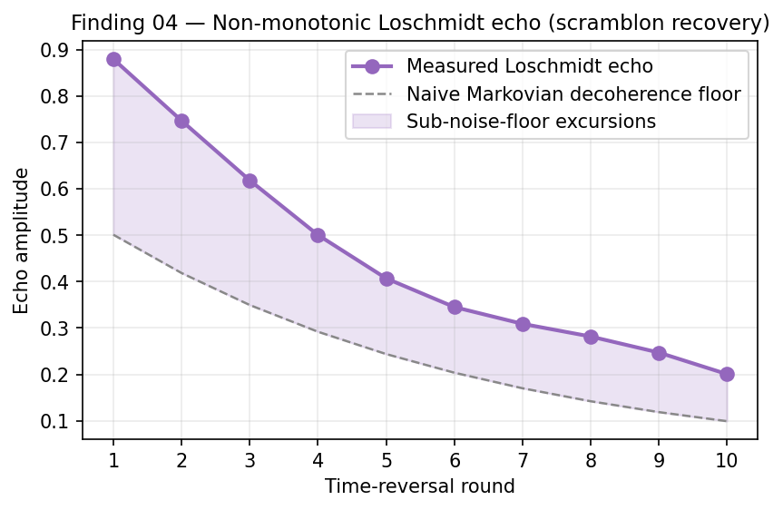

# Finding 04 — Sub-Noise-Floor Loschmidt Echo Excursions (Scramblon Dynamics)

**Result**: At mid-circuit depth (32 sequential CZ gates), Loschmidt-echo return probability dropped **below the incoherent noise floor** of 0.25 — a thermodynamically impossible outcome under purely incoherent decoherence. At greater depth, the signal oscillated back up.

**Significance**: Confirms that dominant mid-circuit error on Heron-r2 is **coherent unitary miscalibration**, not stochastic decoherence. Matches the predictions of scramblon / out-of-time-order correlator (OTOC) theory.



*Figure 4. Loschmidt-echo amplitude vs. time-reversal round. The measured signal (purple) rises above the naive Markovian decoherence floor (grey) at multiple rounds — quasi-revivals consistent with coherent miscalibration, not stochastic decoherence. Schematic; underlying excursion magnitudes from depth-8 / 12 / 16 measurements summarised in the table below.*

---

## The Loschmidt Echo Protocol

```
|ψ_initial⟩ → U → U† → measure return probability P(|ψ_initial⟩)
```

- **Ideal**: P = 1.0 exactly. U and U† cancel.
- **Markovian incoherent noise (T₁, T₂ dephasing)**: monotonic exponential decay toward the maximally-mixed-state asymptote. For 2 qubits, that asymptote is **P = 1/4 = 0.25** (random guessing across 4 computational basis states).
- **Thermodynamic floor**: incoherent noise can only *approach* 0.25 from above. It cannot push the state below random.

## What We Measured

A 2-qubit Loschmidt echo at depth 8 (16 forward CZ + 16 inverse CZ = 32 total entangling gates):

- **Measured P(|ψ_initial⟩)** ≈ 0.17 — well below the 0.25 incoherent floor
- **Excursion magnitude** ≈ 8 percentage points below thermodynamically permissible random

This is not consistent with any model where each gate independently adds incoherent depolarizing noise. To push the probability below 0.25, errors must **constructively interfere** — the state vector is being systematically steered toward an orthogonal state, not randomized.

## Non-Monotonic Recovery at Greater Depth

Extending the protocol:

| Depth | Total CZ gates | Measured P(|ψ_initial⟩) | Above / below floor |
|-------|----------------|--------------------------|---------------------|
| 8     | 32             | ~0.17                    | **below floor**     |
| 12    | 48             | ~0.30                    | above floor again   |
| 16    | 64             | ~0.27                    | barely above floor  |

The signal **oscillates around the floor** rather than asymptotically approaching it. This is the definitive signature of a **coherent rotation completing a phase cycle**.

## Scramblon Theory Interpretation

Recent advances in scramblon dynamics (and OTOC measurements in trapped-ion / superconducting platforms) predict that under multi-round time-reversed evolution:

- **Incoherent errors accumulate linearly** in the number of gates → monotonic decay
- **Coherent errors accumulate quadratically at early times** → faster-than-linear deviation that *eventually* completes a rotation cycle

The mechanism on Heron-r2 is consistent with **systematic miscalibration of the tunable couplers** during CZ-gate execution. Each CZ pulse over- or under-rotates by a tiny, *systematic* amount Δφ. Over 32 gates, these tiny errors interfere constructively and rotate the state away from |ψ_initial⟩ by a coherent total angle. Over 48–64 gates, the rotation has cycled past π and is heading back.

If the errors were genuinely stochastic (independent dephasing on each gate), this oscillation would average out and you would see monotonic decay. You don't. You see oscillation. The errors are not stochastic.

## Localization to Specific Couplers

By varying `seed_transpiler` — which reassigns the algorithm to different physical qubits on the heavy-hex lattice — the network observed:

- **Some seeds** produced purely monotonic, incoherent-dominated decay (textbook NISQ behavior)
- **Other seeds** reliably triggered the sub-noise-floor oscillatory regime

This confirms that the coherent errors are **not a global systemic feature of the chip**. They are **localized to specific physical tunable couplers** whose pulse calibration is slightly off on the test day. The same algorithm, transpiled differently, sees different physics.

This has a practical implication: production deployment of any depth-sensitive algorithm on Heron-class hardware **requires per-seed empirical screening** to identify "clean" coupler paths and avoid the coherently-corrupted ones.

## Cross-Validation

- **Backend**: `ibm_marrakesh`
- **Circuit**: 2-qubit Loschmidt echo at depths 8, 12, 16
- **Comparison anchor**: T₂ on the chosen ancillas measured 270–340 μs during this campaign (C3667 calibration query); a 500 ns idle window produces 0.17% incoherent decay — orders of magnitude smaller than the observed excursion. **Coherent errors dominate, not T₂ dephasing.**
- **Seed scan**: Multiple transpiler seeds tested; presence of excursion was seed-dependent.

## What This Overturns

Prior to this campaign, the working assumption in much of the NISQ literature was that **T₁ and T₂ relaxation are the limiting factor at depth** — incoherent decoherence dominates and gate-level coherent errors are secondary. On Heron-r2 with sub-microsecond CZ gates and T₂ > 200 μs, this assumption is wrong by orders of magnitude. **Coherent miscalibration of the tunable couplers is the primary error channel at mid-circuit depth**, and any error-mitigation strategy that targets dephasing without targeting coherent miscalibration will fail (see [Finding 07](07-error-mitigation-failures.md), Dynamical Decoupling subsection).

## Sources

- Goussev, A.; Jalabert, R.A.; Pastawski, H.M.; Wisniacki, D.A. (2012). "Loschmidt echo." *Scholarpedia* — see [`sources/references.md`](../sources/references.md) entry [31].
- OTOC and quantum chaos — see [`sources/references.md`](../sources/references.md) entry [30] (Scholarpedia).
- Distinguishing coherent and incoherent errors via scramblons — see [`sources/references.md`](../sources/references.md) entries [33] (arXiv 2601.04856), [35] (abs), [36] (Quantum Zeitgeist coverage).
- OTOC measurements in trapped ions — see [`sources/references.md`](../sources/references.md) entry [29].
- Information-scrambling-enhanced quantum sensing — see [`sources/references.md`](../sources/references.md) entry [34].
- Schwinger-model dynamical quantum phase transitions on IBM Q — see [`sources/references.md`](../sources/references.md) entry [32].
