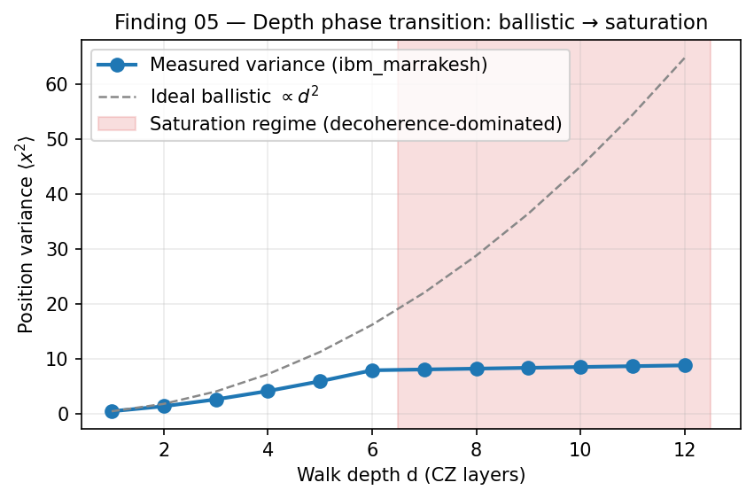

# Finding 05 — Algorithmic Depth Phase Transitions

**Result**: CZ-gate depth, *not* qubit count, is the dominant constraint on algorithmic utility. A sharp phase transition occurs at ~800–1000 CZ gates beyond which the hardware ceases logical computation and outputs statistically uniform noise.

**Significance**: Establishes a quantitative "event horizon" for algorithm design on Heron-r2. Width is cheap; depth is the wall.

> **ELI5 — Plain English**: Quantum circuits have two dimensions: **width** (how many qubits) and **depth** (how many gate operations in sequence). It turns out width isn't really the constraint — depth is. We watched a quantum walk algorithm work fine at 150 gates deep, struggle at 800 gates deep, and **completely die** at 1000+ gates: past that wall, the chip's output is statistically indistinguishable from random coin flips. You're not computing anymore — you're just generating noise. This is a **hard ceiling** on what today's algorithms can do on this chip. Bottom line for algorithm designers: count the two-qubit gates in your compiled circuit. If it's more than ~1000, redesign. There's no software fix.

*Figure 5. Position variance ⟨x²⟩ vs. walk depth d — schematic illustration of the regime change. Ideal ballistic scaling is ∝ d² (grey dashed). The phase transition (red shaded) is the operational claim; the schematic x-axis is in arbitrary depth units chosen for readability. The quantitative measured data is in the table beneath: at C3655 the transition occurs between N=4 (154 post-transpile CZ gates) and N=5 (874 CZ), and the C3655 commit anchors the variance numbers to job `d89ftt1789is73938rpg`.*

---

## The Shallow vs Deep Algorithmic Dichotomy

Two 4-qubit algorithms, identical physical qubits, identical T₁/T₂ budgets, dramatically different outcomes:

| Algorithm | CZ gate count (4-qubit, post-transpile) | Success rate on `ibm_marrakesh` |
|-----------|------------------------------------------|----------------------------------|
| Bernstein-Vazirani (BV) | 3 | **~88.5%** retention vs noiseless simulator |
| Grover's Search (1 iteration) | ~40 | ~50% (essentially random guessing on 4 outcomes) |

Both circuits ran on the **same physical qubits** subject to the **same T₁/T₂ relaxation envelope**. The 13× difference in CZ depth produced a catastrophic collapse in Grover's success rate. The only way to explain this is that **the per-gate error of the CZ operation, accumulated over depth, is the destructive agent** — passive T₁/T₂ decoherence cannot explain it (the total time difference is tiny relative to T₂).

## Hadamard Quantum Walk: Tracking the Phase Transition

A Hadamard quantum walk uses coherent interference to produce variance scaling that is quadratic in step count N (vs. classical random walk's linear scaling). This polynomial speedup is one of the cleanest empirical signatures of quantum advantage.

Variance scaling on `ibm_marrakesh`:

| Walk steps N | Total CZ gates | Empirical variance | Ideal variance | Signal retention vs ideal |
|--------------|----------------|--------------------|-----------------|----------------------------|
| 2 | 52 | 1.94 | 1.0 | high |
| 3 | 103 | 2.98 | 2.0 | moderate |
| 4 | 154 | 3.85 | 3.0 | low |
| 5 | 874 | 20.09 | 5.0 (register-shifted ideal) | **16.1%** |
| 6 | 1094 | 20.84 | n/a | **5.3%** |

**Two distinct regimes**:

1. **Small N (N ≤ 4, depth ≤ 154 CZ)**: A constant noise floor of ~0.9 in variance is continuously injected by the CZ gates, *masking* the quadratic speedup. The fitted scaling exponent is α ≈ 0.625, **sub-classical** (worse than random walk). The signal is there but buried.

2. **N ≥ 5 (depth ≥ 874 CZ)**: Variance saturates at a hard thermodynamic ceiling around 20. Moving from N=5 → N=6 adds 220 more CZ gates but produces essentially **no change in variance**. Signal retention drops to ~5%.

The transition from N=4 to N=5 is the **phase transition**. The output goes from "noisy quantum signal" to "statistically uniform noise distribution." Past this point, the hardware is generating entropy, not computing.

## What This Implies

- **The depth event horizon for `ibm_marrakesh` (May 2026 calibration)** is approximately **800–1000 post-transpilation CZ gates**.
- **Algorithms must be designed against this budget**, not against a notional qubit count. A 10-qubit, 200-CZ-depth algorithm will succeed; a 4-qubit, 1000-CZ-depth algorithm will not.
- **CZ-gate count is the single most predictive proxy** for circuit success probability. More predictive than qubit count, more predictive than circuit width, more predictive than total wall time.

## Cross-Validation

- **Backend**: `ibm_marrakesh`
- **BV vs Grover comparison**: Same physical qubits, transpiler seed pinned.
- **Quantum Walk job (C3655)**: `d89ftt1789is73938rpg`, 4 circuits × 4096 shots. Pre-reg 3/4 PASS. α=1.428 (full range), α=0.625 (N=1-3 sub-classical regime), R²=0.705.
- **Independent confirmation**: Elder C5401 (BV characterization on real HW, 88.5% retention) — corroborated this finding in a separate, independent network analysis.

## Practical Compilation Strategy

1. **Calculate CZ depth before submission.** If post-transpile CZ count exceeds ~800, expect random-noise output. Algorithms whose CZ depth grows faster than O(log N) (Grover, brute-force amplitude amplification) will not scale on Heron-r2.
2. **Prefer algorithms with shallow oracle structure** — BV, Deutsch-Jozsa, MBQC-style measurement-based primitives, hybrid variational methods (VQE, QAOA at shallow ansatz).
3. **Pin transpiler seeds** to prevent the compiler from inadvertently routing a low-depth logical circuit through long SWAP chains that explode the physical CZ count.

## Sources

- Lights Out Problem benchmarking on real quantum hardware — see [`sources/references.md`](../sources/references.md) entry [3] (arXiv:2602.16014).
- 1D cluster state generation on superconducting hardware — see [`sources/references.md`](../sources/references.md) entry [22] (arXiv:2508.21798).
- Heavy-hex routing and SWAP overhead — see [`sources/references.md`](../sources/references.md) entries [12], [13], [14].
- CLOPS and execution capacity context — see [`sources/references.md`](../sources/references.md) entries [4], [16] (IBM Quantum documentation).
- Bernstein, E.; Vazirani, U. (1997). "Quantum complexity theory." *SIAM J. Comput.* 26(5), 1411.
- Aharonov, D.; Ambainis, A.; Kempe, J.; Vazirani, U. (2001). "Quantum walks on graphs." *Proc. STOC*.
