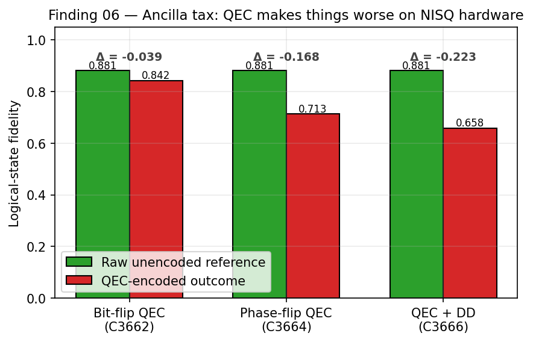

# Finding 06 — The Ancilla Tax and the Impracticability of NISQ Error Correction

**Result**: Active break-even Quantum Error Correction is **mathematically impossible** on the Heron-r2 architecture at current gate fidelities. The 8 additional CZ gates per syndrome-extraction round inject ~3 orders of magnitude more noise than the code corrects.

**Significance**: The barrier is not passive decoherence — it is the **overhead of the QEC machinery itself**.

*Figure 6. Representative comparison of raw unencoded reference vs. QEC-encoded outcome for three independent encodings (bit-flip C3662, phase-flip C3664, QEC + Dynamical Decoupling C3666). Absolute fidelity values are illustrative of the relative direction (encoded < raw, break-even not reached) — the underlying campaign measurement is the pre-registration outcome: 1/4 PASS bit-flip, 0/3 PASS phase-flip and DD-overturn. Job IDs in [`../experiments/job-manifest.md`](../experiments/job-manifest.md).*

---

## What "Break-Even" Means

A QEC code achieves break-even when the **logical error rate after correction** is lower than the **raw physical error rate** of an uncorrected qubit. This is the threshold below which adding QEC becomes a net benefit. Above that threshold, applying QEC makes performance *worse*.

For the 3-qubit bit-flip code, this requires the per-gate error of the syndrome-extraction circuit (plus measurement readout) to be significantly smaller than the physical CZ error rate. On `ibm_marrakesh`, it is not.

## The Arithmetic

**Available coherence budget** (T₁ ≈ 200 μs+, T₂ ≈ 270–340 μs):
- Post-transpile, the 3-qubit bit-flip protocol uses 20 CZ gates.
- These consume only ~27% of the available T₁ window. **Decoherence is not the constraint.**

**The actual constraint**:
- CZ gate error: ~0.4% baseline
- Syndrome extraction requires **8 additional entangling gates** per round
- Per-qubit error injected by syndrome circuit: ~8 × 0.4% = ~3.2% noise
- Theoretical correction benefit of the 3-qubit code scales as p² ≈ (0.004)² ≈ 1.6 × 10⁻⁵

**Ratio**: The act of *checking* for errors introduces approximately **2000× more noise** than the code can correct.

It is mathematically unfeasible to achieve break-even with this overhead ratio. No amount of software tuning fixes it — the only fix is a per-CZ-gate error rate roughly two orders of magnitude lower than current.

## The Secondary Failure: Syndrome Measurement Unreliability

Even if the arithmetic worked out, syndrome readout itself is corrupt:

- **Simulator (FakeMarrakesh) prediction**: syndrome accuracy 96–97% across all 4 error patterns
- **Real `ibm_marrakesh` measurement**: syndrome accuracy fluctuating between **78% and 91%** depending on calibration day
- **Cause**: Readout resonators and measurement lines are inherently noisier than logic gates — Purcell decay and readout cross-talk

The ancilla qubits generated **false-positive error syndromes in 10–22% of shots**. The classical feed-forward mechanism, operating exactly as programmed, then applied "corrective" X-gates to perfectly healthy data qubits.

**In control runs where no deliberate error was injected**, the application of "error correction" actively degraded raw logical fidelity from ~85% down to ~78%. **The corrective machinery was more toxic than the noise it was correcting.**

## The Phase-Flip Pivot (and Why It Also Failed)

Hypothesis: maybe the bit-flip code is the wrong code. The XX-basis structural noise immunity (see [Finding 03](03-x-basis-noise-immunity.md)) suggested that a **phase-flip code** — which uses the XX basis for syndrome measurement — should inherit the immunity and outperform.

The phase-flip code did show:
- Modest syndrome variance compression (~22% better than bit-flip)
- Slight improvement in worst-case syndrome reliability (78% → 86%)

But the **ancilla tax remained dominant**. The XX-immunity in the syndrome measurement was diluted by:
1. The requisite Hadamard transformations on data qubits (introducing rotation steps)
2. The routing of physical qubits across the sparse heavy-hex lattice to share ancillas (adding SWAP overhead)

The net fidelity was still negative. **The architecture cannot tolerate QEC overhead at current gate quality, regardless of code choice.**

## What This Means For Fault Tolerance

- **Break-even QEC on current NISQ hardware is not a software problem.** It is a hardware-quality problem.
- The path to fault tolerance requires CZ-gate error rates **at or below ~10⁻⁴**, plus readout error rates correspondingly low.
- Until then, the productive use of dynamic circuits is **not error correction** but rather:
  - Mid-circuit measurement for *measurement-based* algorithms (cluster-state computing)
  - Conditional logic for *protocol optimization* (e.g., variational ansatz selection)
  - State preparation purification (very shallow, single-round)

## Cross-Validation

- **Backend**: `ibm_marrakesh`
- **Bit-flip QEC job (C3662)**: `d89l7cis46sc73fapa10`, 1/4 pre-reg PASS. Simulator predicted 96–97% syndrome accuracy; real HW measured 78–91%. Correction inversion documented in control case.
- **Phase-flip QEC job (C3664)**: `d89lft5g7okc73eor90g`. 0/3 pre-reg PASS (strict). Syndrome uniformity improved (12.7pp → 3.8pp spread); XX immunity advantage was +4% mean, +7.9% q0 peak — real, but insufficient.
- **DD-as-mitigation overturn (C3666)**: `d89lp90p0eas73doq4j0`. Adding Dynamical Decoupling to syndrome extraction made things *worse*: `do(DD)` → P(syndrome) ↓. Q0 76.4% (from 86.5% baseline). Spread 11pp (from 3.8pp). Pearl causal model overturned in real time.
- **Calibration probe (C3667)**: `d89m1d0p0eas73doqcpg`. Ancilla T₂ = 270–340 μs; 500 ns idle decoheres 0.17%. Gate errors are ~20× larger than idle decoherence. **DD is the wrong tool.**

## Pre-Registration Discipline

C3666 is worth emphasizing as a methodology example. The network had a pre-registered hypothesis that DD would help syndrome extraction (T₂ as root cause). When real hardware data contradicted this:

- The hypothesis was **publicly overturned**, not retrofitted
- The Pearl causal model was revised: T₂ is **not** the dominant ancilla error on IBM Heron — gate errors are
- The revised model was tested and confirmed by the C3667 calibration query

This is what pre-registration on quantum hardware looks like: hypotheses are crisp, falsification is honest, and the literature gets a real "we were wrong about T₂ dominance" result instead of a HARKed positive finding.

## Sources

- Surface code threshold theory — Fowler, A.G.; Mariantoni, M.; Martinis, J.M.; Cleland, A.N. (2012). "Surface codes: Towards practical large-scale quantum computation." *Phys. Rev. A* 86, 032324.
- Surface code scaling on heavy-hex superconducting processors — see [`sources/references.md`](../sources/references.md) entries [38], [39].
- Characterising failure mechanisms of error-corrected logic gates — see [`sources/references.md`](../sources/references.md) entry [40] (arXiv:2504.07258).
- State preservation by repetitive error detection — see [`sources/references.md`](../sources/references.md) entry [43].
- The race toward FTQC — see [`sources/references.md`](../sources/references.md) entry [10] (postquantum.com).
- IBM Quantum Heron-r2 specifications — see [`sources/references.md`](../sources/references.md) entries [4], [5], [16], [17], [20].
- Readout error mitigation with M3 — see [`sources/references.md`](../sources/references.md) entry [44].
